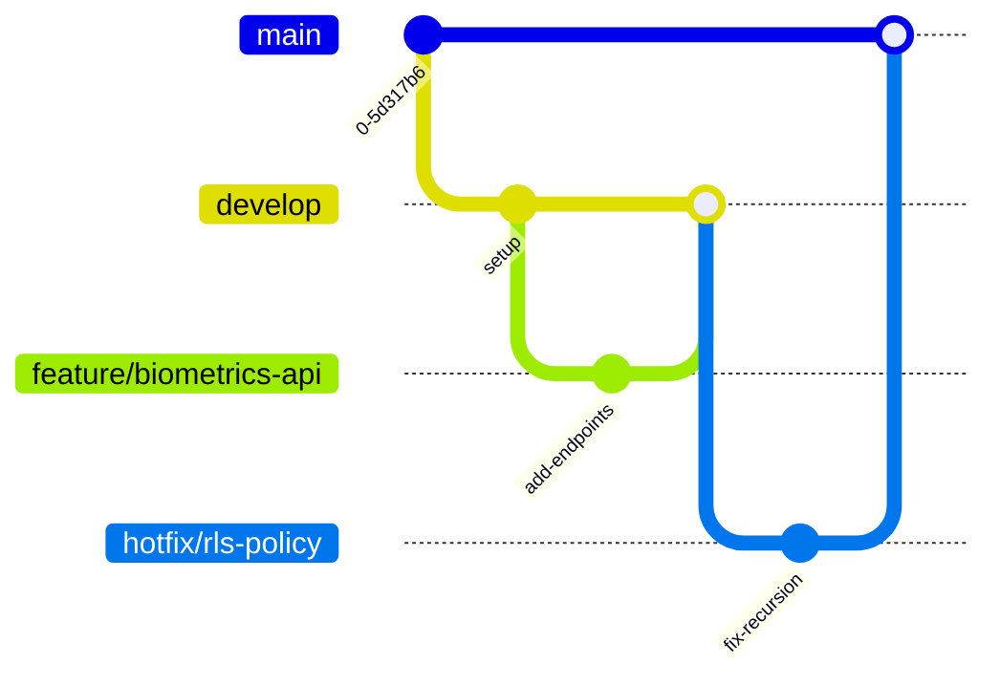

# Contributor Guidelines 🤝

Welcome to the CareSync project! These guidelines ensure the codebase remains clean, secure, and maintainable.

---

## 1. Branching Strategy & Git Workflow

We use a Git branching strategy similar to GitFlow:



### Flow Details
* **`main`**: Production-ready release branch. Directly protected. Code only merges via pull requests from `develop` or approved `hotfix/` branches.
* **`develop`**: Integration branch for features.
* **`feature/*`**: Short-lived feature branches cut from `develop`.
* **`hotfix/*`**: Immediate patches cut from `main` to address critical bugs in production.

---

## 2. Commit Message Conventions (Conventional Commits)

Commit messages must follow the [Conventional Commits](https://www.conventionalcommits.org/) specification:
```text
<type>(<scope>): <description>

[optional body]

[optional footer(s)]
```

### Types
* **`feat`**: A new feature (e.g. `feat(biometrics): add multi-pose consensus verification`).
* **`fix`**: A bug fix (e.g. `fix(auth): resolve infinite RLS policy recursion`).
* **`docs`**: Documentation updates.
* **`style`**: Code formatting changes (whitespace, missing semi-colons, etc.) that do not affect behavior.
* **`refactor`**: Code changes that neither fix bugs nor add features.
* **`test`**: Adding missing tests or correcting existing tests.

---

## 3. Coding Standards & Styles

### Dart & Flutter (Client)
* Follow the official [Dart Style Guide](https://dart.dev/guides/language/effective-dart/style).
* Run analyzer lint rules before committing code:
  ```bash
  flutter analyze
  ```
* Format your code:
  ```bash
  flutter format lib/
  ```

### Python (Biometrics API)
* Code must follow [PEP 8](https://peps.python.org/pep-0008/) style standards.
* Limit all lines to a maximum of 79 characters where possible.
* Use `flake8` or `black` for automatic code formatting.

### SQL (Supabase Migrations)
* Write SQL keywords in UPPERCASE (e.g. `SELECT`, `INSERT INTO`, `WHERE`, `RETURNS TRIGGER`).
* Use `snake_case` for table and column names.
* Document triggers, functions, and helper scripts with clear SQL comments.

---

## 4. Pull Request (PR) Checklist

Before submitting a pull request for review, verify that:
1. [ ] Code builds cleanly and passes all local static analysis checks (`flutter analyze`).
2. [ ] All unit, widget, and integration tests pass successfully (`flutter test` and python pipeline tests).
3. [ ] All new functions, APIs, and components are fully documented.
4. [ ] No hardcoded keys, passwords, or secret tokens are present in the code.
5. [ ] Migration files are ordered sequentially and deploy without SQL conflicts.
