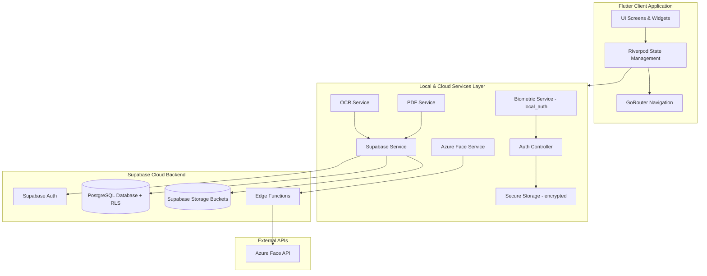
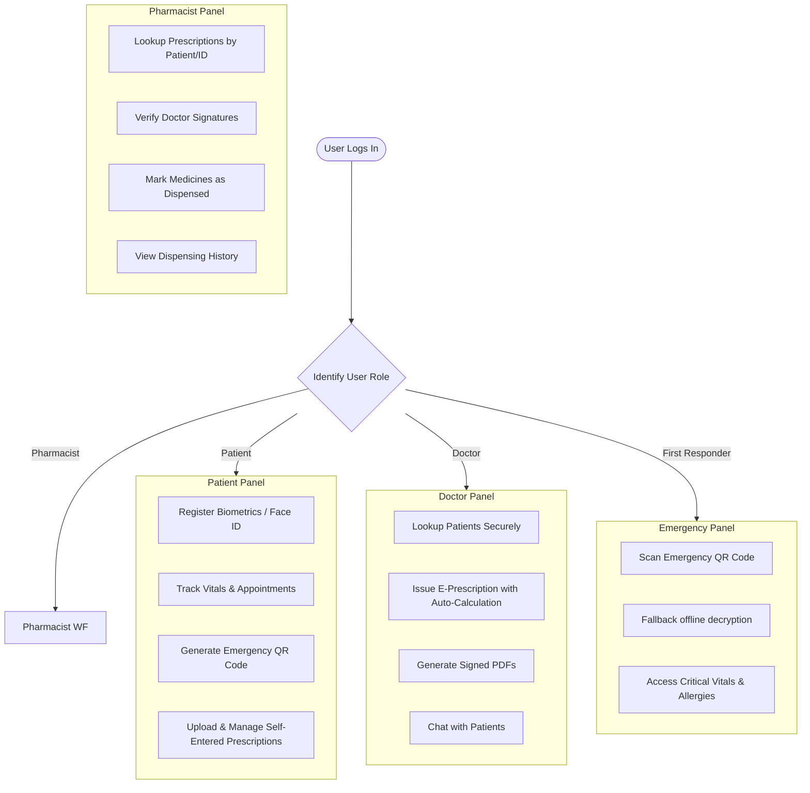

# CareSync - Biometric Medical Logging & E-Prescription Platform

CareSync is a highly secure, HIPAA-compliant, biometric-authenticated medical logging and electronic prescription application built with **Flutter**, **Riverpod**, and **Supabase**. It facilitates secure interaction between Patients, Doctors, Pharmacists, and First Responders, backed by advanced on-device and cloud biometrics (Azure Face API).

---

## 🏗️ System Architecture

The following diagram illustrates the CareSync architecture, from the Flutter mobile frontend and the services layer to the Supabase backend and external APIs:



---

## 👥 Roles & Workflows

CareSync enforces strict role-based access controls (RBAC) to ensure confidentiality and efficiency across four distinct user groups:



### 1. Patient Workflow
* **Biometric Enrollment & Verification**: Complete identity verification with ID documents, selfies, and Azure Face biometric scanning. Subsequent logins on the same device are handled instantly via native biometrics (Face ID/Fingerprint).
* **Vitals & Health Tracking**: Log and visualize blood pressure, heart rate, weight, blood sugar, and oxygen levels.
* **Appointments & Messaging**: Book appointments with doctors and chat with them in real-time.
* **Emergency QR Generation**: Generates a secure, encrypted QR code. It encodes critical medical history (allergies, chronic conditions, emergency contacts) directly in the payload so that first responders can read it even when completely offline.

### 2. Doctor Workflow
* **Patient Lookup & Records Access**: Securely search for registered patients and review their medical history, chronic conditions, and past prescriptions.
* **Smart E-Prescriptions**: Create prescriptions featuring:
  * Automatic medication quantity calculations based on dosage and frequency.
  * Validation rules ensuring invalid frequencies or durations are flagged.
  * Autocomplete search for medicines and laboratory tests.
  * Integration of the doctor's official signature.
* **Signed PDF Generation**: Generate a signed prescription PDF for patients.

### 3. Pharmacist Workflow
* **Verification & Dispensation**: Access patient prescription databases, view original uploaded or generated doctor prescriptions, check safety alerts, and record the dispensing of individual items.
* **Dispensing History**: Access audit trails and lists of past dispensed items for security verification.

### 4. First Responder Workflow
* **Emergency QR Scanning**: Scan a patient's QR code using the in-app scanner to bypass normal authentication and instantly view life-saving details:
  * Blood group, height, and weight.
  * Active chronic conditions and severe allergies.
  * Active prescriptions and emergency contacts.
* **Offline Operations**: Built-in fallback decryption allows direct read-out without requiring an internet connection.

---

## 🔒 Security & Compliance

### 1. Dual-Layer Biometric Verification
CareSync combines local on-device hardware verification with cloud-based biometric scanning:
* **Local Biometrics (`local_auth`)**: Native Fingerprint/Face ID triggers the release of local encrypted session keys from the device's Secure Enclave/TEE.
* **Cloud Biometrics (Azure Face)**: Integrates with Azure Face API to perform high-confidence identity verification during KYC enrollment.

### 2. Know Your Customer (KYC) & Two-Factor Authentication (2FA)
* **Identity Audits**: Patient registration requires identity document uploads and selfies matched via face verification.
* **2FA (Email & SMS OTP)**: When logging in from a new, untrusted device, users must input a one-time passcode. Successful authentication registers the device.
* **Revocations**: Patients can view all registered devices on their profile and revoke access to any device at any time.

### 3. 15-Minute Session Timeout & Auditing
* **Automatic Expiry**: Sessions are automatically locked after 15 minutes of inactivity, requiring biometric re-authentication.
* **Audit Trail**: Every critical action (record access, device registration, KYC verification, logins) writes an immutable record to the `audit_log` database table with device models, timestamps, and action categories.

---

## 📂 Project Structure

```
.
├── docs/                           # Detailed feature design & summaries
├── android/                        # Android native configurations
├── ios/                            # iOS native configurations
├── lib/                            # Flutter Source Directory
│   ├── app.dart                    # Application setup & theming
│   ├── main.dart                   # Application entry point
│   ├── core/                       # Shared design system, utils & config
│   │   ├── config/                 # Environment configs (Supabase API keys)
│   │   ├── theme/                  # Color tokens, styles, and typography
│   │   └── widgets/                # Core reusable widgets (e.g. BiometricGuard)
│   ├── routing/                    # GoRouter navigation paths & guards
│   │   ├── app_router.dart
│   │   └── route_names.dart
│   ├── services/                   # Business logic APIs & Backend integration
│   │   ├── auth_controller.dart    # Login, signup, device registry, 2FA
│   │   ├── azure_face_service.dart # Azure Face verification API
│   │   ├── biometric_service.dart  # local_auth integrations
│   │   ├── supabase_service.dart   # Core DB & storage client
│   │   ├── pdf_service.dart        # Prescription PDF generators
│   │   ├── ocr_service.dart        # OCR parsing of uploaded files
│   │   └── ...                     # Vitals, chat, and appointments logic
│   └── features/                   # Feature modules
│       ├── auth/                   # Sign-in, sign-up, KYC, and 2FA UIs
│       ├── patient/                # Dashboards, vitals tracker, QR code codes
│       ├── doctor/                 # Dashboards, prescription forms, lookups
│       ├── pharmacist/             # Prescription dispensing dashboards
│       ├── first_responder/        # QR Scanner & emergency charts
│       ├── emergency/              # Emergency access views
│       ├── family/                 # Family members management screen
│       └── shared/                 # Chat screens, profiles, and notifications
├── supabase/                       # Supabase Backend Configuration
│   ├── functions/                  # Supabase Edge Functions (e.g., Azure Face)
│   └── *.sql                       # Numbered SQL migrations (001 to 016)
└── pubspec.yaml                    # Package dependencies & assets configuration
```

---

## 🚀 Getting Started

### Prerequisites
* Flutter SDK (3.7+)
* Supabase Account & Database Project
* Azure Cognitive Services Account (optional for Azure Face features)

### 1. Set Up Backend (Supabase)
1. Register/Login to [supabase.com](https://supabase.com) and spin up a new project.
2. Under **SQL Editor**, execute the numbered SQL files in chronological order from the `supabase/` folder (`001_schema.sql` through `016_azure_face_schema.sql`).
3. Create a private bucket named `kyc-documents` in your Supabase Storage.

### 2. Configure Environment
1. Clone this repository locally.
2. In `lib/core/config/env_config.dart`, update your Supabase secrets:
   ```dart
   abstract class EnvConfig {
     static const String supabaseUrl = 'https://your-supabase-url.supabase.co';
     static const String supabaseAnonKey = 'your-anon-key-here';
   }
   ```
3. *(Optional)* Deploy the Azure Face Edge Function under `supabase/functions/azure-face/` and set your Azure Face endpoint/key environment variables.

### 3. Run the App
1. Install dependencies:
   ```bash
   flutter pub get
   ```
2. Launch a target emulator or connected physical device and run:
   ```bash
   flutter run
   ```

---

## 📄 License
This project is licensed under the MIT License.
