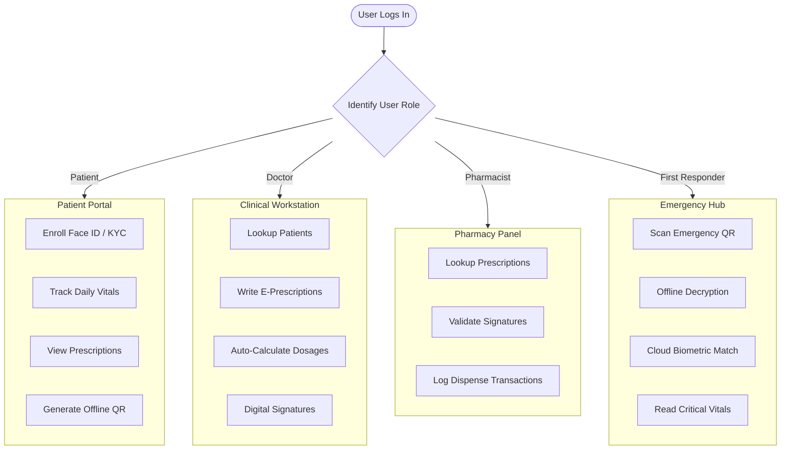
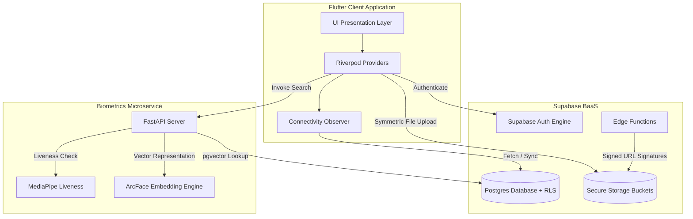

# CareSync 🏥 — Unified Biometric Healthcare Companion

[](LICENSE)
[](https://flutter.dev)
[](https://supabase.com)
[](https://fastapi.tiangolo.com)
[](https://www.python.org)

CareSync is an enterprise-grade, offline-resilient healthcare orchestration platform designed to facilitate secure, role-based workflows for Patients, Doctors, Pharmacists, and First Responders. 

Designed with HIPAA-aligned security principles, CareSync combines robust client-side encryption, immutable database audit logs, and a custom biometric identification engine to grant instant access to critical health data in emergencies.

---

## 📖 Table of Contents
* [System Overview](#-system-overview)
* [Core Features & Sprint Landmark Updates](#-core-features--sprint-landmark-updates)
* [Role-Based Workflows](#-role-based-workflows)
* [Technology Stack](#-technology-stack)
* [Ecosystem Architecture](#-ecosystem-architecture)
* [Project Structure](#-project-structure)
* [Quick Start & Installation](#-quick-start--installation)
* [Environment Configuration](#-environment-configuration)
* [Development & Contribution Workflow](#-development--contribution-workflow)
* [Testing & Quality Assurance](#-testing--quality-assurance)
* [Security & Compliance Highlights](#-security--compliance-highlights)
* [Ecosystem Documentation Index](#-ecosystem-documentation-index)
* [Ecosystem Roadmap](#-ecosystem-roadmap)
* [License & Acknowledgments](#-license--acknowledgments)

---

## 🔍 System Overview

In emergency medical scenarios, every second counts. If a patient is incapacitated, first responders require immediate access to vital records (allergies, chronic conditions, and emergency contacts) without compromising patient privacy under normal operations.

CareSync achieves this balance with a **Dual-Layer Biometric Verification Architecture**:
1. **Local Biometrics (`local_auth`)**: Secures local device screens, session lock control, and routine access.
2. **Cloud Biometrics (ArcFace + pgvector)**: Translates multi-pose facial frames into 512-dimension vector representations, matching face scans against registered profiles for rapid patient identification during emergencies.

---

## 🚀 Core Features & Sprint Landmark Updates

### ⚡ Performance & Caching (Sprint 1)
* **Signed URL Optimization**: Reduces bandwidth overhead by serving secure, expires-bounded media requests directly via CDN layers.
* **Paginated Lookups**: Implemented server-side pagination for medical histories, prescriptions, and logs to maintain sub-100ms response times.
* **Connectivity Observer**: Active network state listener adjusts UI components and switches queries seamlessly between local cache and cloud database.
* **Index Hardening**: Custom pgvector HNSW and B-Tree indexes enable sub-50ms search query responses.

### 🛠️ Maintainability & Design DNA (Sprint 2)
* **Clean Code Architecture**: Enforces a strict separation of concerns into distinct `presentation`, `domain`, `data`, and `application` layers.
* **Modular UI Components**: Fully extracted reusable widgets (e.g. shared cards, input forms, and app bars) conforming to the unified styling system.
* **Responsive Grid Alignment**: Redesigned vital dashboard widgets to use modular grids for a professional, compact dashboard layout.

### 🛡️ Operations & Reliability (Sprint 3)
* **Structured JSON Logging**: Implemented application-wide structured loggers to capture system events with category tags and error traces.
* **Global Error Boundaries**: Added robust UI error catches and fallback layouts to handle network failure gracefully.
* **Multi-Tier Environment Separation**: Full separation of environments via `.env` (Development), `.env.staging` (Staging), and `.env.production` (Production) files.

---

## 👥 Role-Based Workflows

CareSync uses custom triggers and policies to enforce Role-Based Access Controls (RBAC):


```mermaid
flowchart TD
    Start([User Logs In]) --> RoleCheck{Identify User Role}
    
    RoleCheck -->|Patient| PatientWF[Patient Portal]
    RoleCheck -->|Doctor| DoctorWF[Clinical Workstation]
    RoleCheck -->|Pharmacist| PharmacistWF[Pharmacy Panel]
    RoleCheck -->|First Responder| FRWF[Emergency Hub]

    subgraph PatientWF [Patient Portal]
        P1[Enroll Face ID / KYC]
        P2[Track Daily Vitals]
        P3[View Prescriptions]
        P4[Generate Offline QR]
    end

    subgraph DoctorWF [Clinical Workstation]
        D1[Lookup Patients]
        D2[Write E-Prescriptions]
        D3[Auto-Calculate Dosages]
        D4[Digital Signatures]
    end

    subgraph PharmacistWF [Pharmacy Panel]
        Ph1[Lookup Prescriptions]
        Ph2[Validate Signatures]
        Ph3[Log Dispense Transactions]
    end

    subgraph FRWF [Emergency Hub]
        F1[Scan Emergency QR]
        F2[Offline Decryption]
        F3[Cloud Biometric Match]
        F4[Read Critical Vitals]
    end
```

---

## 💻 Technology Stack

* **Frontend Client**: [Flutter SDK 3.7+](https://flutter.dev) (Dart), [Riverpod](https://riverpod.dev) (State Management), and [GoRouter](https://pub.dev/packages/go_router) (Routing).
* **Backend Database**: [Supabase](https://supabase.com) (PostgreSQL, Realtime sync, storage buckets, and RLS policies).
* **Biometrics API**: [FastAPI](https://fastapi.tiangolo.com) + [Uvicorn](https://www.uvicorn.org) (Python microservice).
* **AI & Machine Learning**: ArcFace for facial feature extraction, Google MediaPipe Face Mesh for multi-pose landmark and liveness validation.

---

## 🏗️ Ecosystem Architecture

The following diagram maps the structural interactions between the Flutter client, database backend, storage buckets, and Custom Biometrics API:


```mermaid
graph TB
    subgraph Client [Flutter Client Application]
        UI[UI Presentation Layer]
        RP[Riverpod Providers]
        CO[Connectivity Observer]
    end

    subgraph Supabase [Supabase BaaS]
        Auth[Supabase Auth Engine]
        DB[(Postgres Database + RLS)]
        Storage[(Secure Storage Buckets)]
        EF[Edge Functions]
    end

    subgraph PythonAPI [Biometrics Microservice]
        FastAPI[FastAPI Server]
        MF[MediaPipe Liveness]
        AF[ArcFace Embedding Engine]
    end

    %% Flow lines
    UI --> RP
    RP --> CO
    CO -->|Fetch / Sync| DB
    RP -->|Authenticate| Auth
    RP -->|Symmetric File Upload| Storage
    RP -->|Invoke Search| FastAPI
    FastAPI -->|Liveness Check| MF
    FastAPI -->|Vector Representation| AF
    FastAPI -->|pgvector Lookup| DB
    EF -->|Signed URL Signatures| Storage
```

---

## 📂 Project Structure

```
.
├── .agents/                    # Internal agent guidelines & release runbooks
├── biometric_api/              # FastAPI Python facial recognition service
├── docs/                       # Core architectural and deployment guides
│   ├── archive/                # Historical summaries and design documents
│   └── database/               # Database catalogs and documentation
├── ios/                        # iOS-specific build wrappers
├── lib/                        # Flutter client source directory
│   ├── core/                   # Shared theme styling, design tokens, and utilities
│   ├── features/               # Domain-specific vertical feature slices
│   │   ├── appointments/       # Booking FSM & schedules
│   │   ├── auth/               # authentication, secure storage, and 2FA
│   │   ├── emergency/          # Emergency QR generation and first responder views
│   │   ├── patient/            # Patient dashboards and vitals track
│   │   └── shared/             # Shared profile and navigation layouts
│   ├── routing/                # App router declaration and GoRouter guards
│   └── services/               # Core API connectors (Supabase, Secure Storage)
├── supabase/                   # Supabase migrations schema scripts & RLS policies
└── test/                       # Unit and widget test suite
```

---

## 🚀 Quick Start & Installation

### Step 1: Clone the Repository
```bash
git clone https://github.com/ankurrera/CareSyncMain.git
cd CareSyncMain
```

### Step 2: Configure Environment Files
1. Copy the environment template:
   ```bash
   cp .env.development.example .env
   ```
2. Open `.env` and fill in your Supabase configurations and local endpoint values:
   ```env
   SUPABASE_URL=https://your-project.supabase.co
   SUPABASE_ANON_KEY=your-anon-key
   BIOMETRIC_API_URL=http://127.0.0.1:8000
   ```

### Step 3: Spin Up the Biometrics API
1. Navigate to the api directory and create a virtual environment:
   ```bash
   cd biometric_api
   python3 -m venv venv
   source venv/bin/activate
   ```
2. Install dependencies:
   ```bash
   pip install --upgrade pip
   pip install -r requirements.txt
   ```
3. Preload the weights of the neural networks:
   ```bash
   python download_models.py
   ```
4. Start the server:
   ```bash
   uvicorn main:app --reload --host 127.0.0.1 --port 8000
   ```

### Step 4: Run the Flutter App
Return to the project root and start the application:
```bash
flutter pub get
flutter run
```

---

## ⚙️ Environment Configuration

CareSync supports three main build tiers managed through individual env files:
* **Development (`.env`)**: Maps to local database configurations and uvicorn API instances.
* **Staging (`.env.staging`)**: Connects to the cloud staging databases and sandbox API environments.
* **Production (`.env.production`)**: Links to production Supabase nodes and secure GCP instances.

See the [Environment Guide](./docs/ENVIRONMENT_GUIDE.md) for step-by-step setup details.

---

## 🛠️ Development & Contribution Workflow

Developers must adhere to strict code standards:
* **Branch Strategy**: Direct commits to `main` are allowed and preferred.
* **Commit Guidelines**: Use semantic commit structures: `type(scope): message` (e.g. `feat(auth): add face ID lock`).
* **Pre-flight Quality Check**: Never push code before running standard verification:
  ```bash
  npm run lint && npm run build && npm run test       # Web components (if any)
  flutter analyze && dart format --output=none lib/   # Flutter client components
  ```

For more details, see [CONTRIBUTING.md](./CONTRIBUTING.md).

---

## 🧪 Testing & Quality Assurance

* **Flutter Unit & Widget Tests**:
  ```bash
  flutter test
  ```
* **Python Biometrics Unit Tests**:
  ```bash
  cd biometric_api
  python -m unittest test_biometric_pipeline.py
  ```

Review [Testing Guidelines](./docs/TESTING.md) to write and verify new test files.

---

## 🛡️ Security & Compliance Highlights

* **Designed-for HIPAA Security**: Segmented clinical vs demographic datasets, symmetric QR encryption, and access validation guards.
* **Immutable Database Triggers**: SQL triggers raise exceptions on any updates or deletions within `biometric_access_logs`.
* **Encryption Protocols**: AES-256-GCM symmetric encryption for offline QR code storage, and HTTPS/WSS channels for cloud traffic.

For deep-dive compliance details, review the [Security & HIPAA Document](./docs/SECURITY.md).

---

## 📂 Ecosystem Documentation Index

Refer to the following guides for detailed architecture, design specifications, and operations details:

| Category | Guide | Purpose |
|:---|:---|:---|
| **System Guides** | [System Architecture](./docs/SYSTEM_ARCHITECTURE.md) | Component layouts and sequence flows. |
| | [Flutter Client Architecture](./docs/FLUTTER_ARCHITECTURE.md) | Riverpod state modeling & clean design layers. |
| | [Backend Architecture](./docs/BACKEND_ARCHITECTURE.md) | FastAPI startup configurations and endpoints. |
| | [Biometrics Deep-Dive](./docs/BIOMETRIC_SYSTEM.md) | ArcFace calculations and consensus thresholds. |
| | [Biometric Workflow Guide](./docs/BIOMETRIC_WORKFLOW_GUIDE.md) | Enrollment/Verification sequence details. |
| **Database & API**| [Database Schema Audit](./docs/DATABASE.md) | Entity relationships, indexing, pgvector layout. |
| | [API Endpoint Reference](./docs/API_REFERENCE.md) | Request/Response JSON payloads. |
| | [Biometric Performance](./docs/BIOMETRIC_PERFORMANCE.md) | Real-world benchmark stats and latency profiles. |
| **Operations** | [Security & Compliance](./docs/SECURITY.md) | Cryptographic QR specs, RLS policy mappings. |
| | [Deployment & Devops](./docs/DEPLOYMENT.md) | Docker, Hugging Face, environment parameters. |
| | [Developer Guide](./docs/DEVELOPER_GUIDE.md) | Local machine initialization steps. |
| | [Testing Guide](./docs/TESTING.md) | Static analysis checks and unit tests. |
| | [Database Migrations Registry](./supabase/MIGRATIONS.md) | Sequential migration timeline details. |
| | [Environment Guide](./docs/ENVIRONMENT_GUIDE.md) | Configuration matrix across environment tiers. |
| | [Release Runbook](./.agents/RELEASE_RUNBOOK.md) | Release validation steps & checklists. |
| | [Troubleshooting Guide](./docs/TROUBLESHOOTING.md) | Recovery scripts for common build bugs. |

---

## 🗺️ Ecosystem Roadmap

Our current goals focus on expanding biometric capability and data standards:
* **Multi-Pose TFLite extraction**: Execute liveness calculations directly on mobile devices without microservice roundtrips.
* **FHIR HL7 Standards Compliance**: Match clinical databases to FHIR representation standard.
* **Offline Mesh Sync**: Direct device-to-device verification overlays using bluetooth mesh relays.

Review the complete [Roadmap Guide](./docs/ROADMAP.md) to explore future milestones.

---

## 📝 License & Acknowledgments

* **License**: CareSync is distributed under the MIT License. See [LICENSE](LICENSE) for details.
* **Credits**: Built using MediaPipe landmark engines and DeepFace ArcFace models. 
