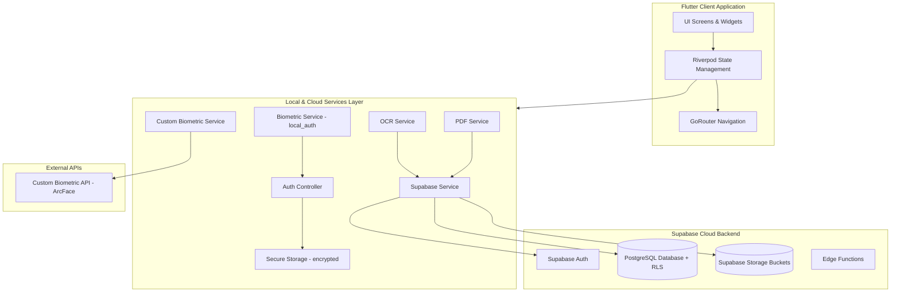
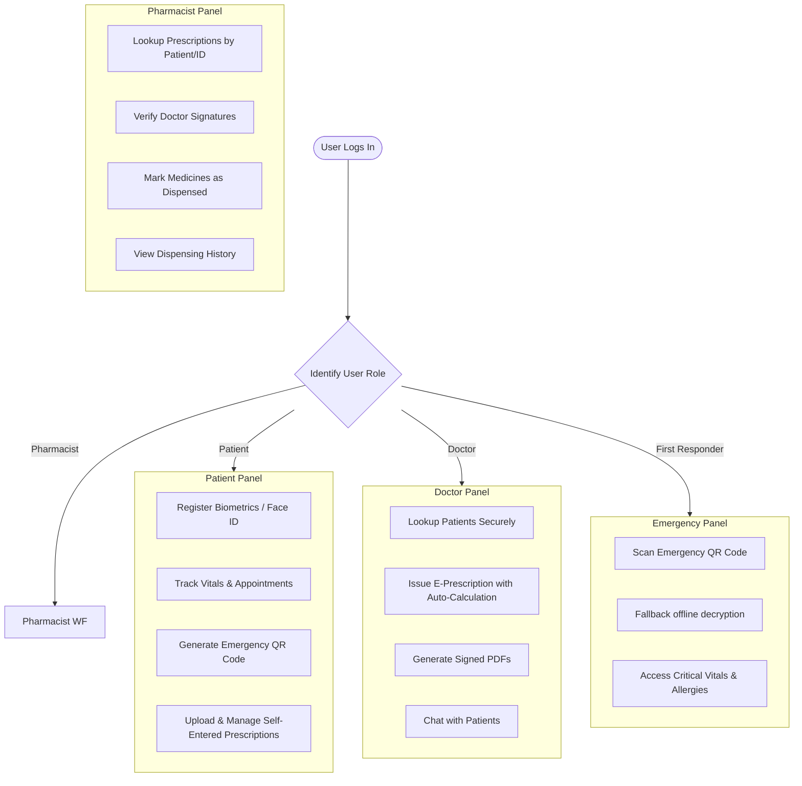

# CareSync 🏥

[](LICENSE)
[](https://flutter.dev)
[](https://supabase.com)
[](https://fastapi.tiangolo.com)
[](https://www.python.org)

CareSync is a highly secure, HIPAA-compliant, biometric-authenticated medical logging and electronic prescription application. It facilitates seamless and secure interactions between Patients, Doctors, Pharmacists, and First Responders. 

The platform features a custom, self-hosted facial recognition API powered by ArcFace and pgvector to securely identify patients and release life-saving medical data to first responders in emergency situations.

---

## 📖 Table of Contents

- [Overview](#-overview)
- [System Architecture](#-system-architecture)
- [Roles & Workflows](#-roles--workflows)
- [Tech Stack](#-tech-stack)
- [Repository Structure](#-repository-structure)
- [Installation & Setup](#-installation--setup)
- [Environment Variables](#-environment-variables)
- [Database Configuration](#-database-configuration)
- [Authentication & Device Security](#-authentication--device-security)
- [API Reference](#-api-reference)
- [Security & Compliance](#-security--compliance)
- [Performance Optimizations](#-performance-optimizations)
- [Testing & Quality Assurance](#-testing--quality-assurance)
- [Troubleshooting](#-troubleshooting)
- [Contributing](#-contributing)
- [License](#-license)

---

## 🔍 Overview

CareSync was built to bridge the gap between patient confidentiality and emergency medical responsiveness. 

In a medical crisis, seconds save lives. If a patient is unconscious or incapacitated, first responders need immediate access to critical medical history (allergies, chronic conditions, emergency contacts) without violating privacy regulations during normal operations. 

CareSync achieves this through a **dual-layer biometric verification system**:
1. **Local Biometrics (`local_auth`)** for quick, secure user login.
2. **Cloud Biometrics (ArcFace + Supabase pgvector)** for secure, real-time emergency identification of patients.

---

## 🏗️ System Architecture

The following diagram illustrates the CareSync architecture, tracing request flows from the Flutter mobile client and biometric API down to the PostgreSQL database and storage layers:


```mermaid
graph TD
    %% Frontend Applications %%
    subgraph Frontend [Flutter Client Application]
        UI[UI Screens & Widgets]
        RP[Riverpod State Management]
        Router[GoRouter Navigation]
    end

    %% Services Layer %%
    subgraph Services [Local & Cloud Services Layer]
        BS[Biometric Service - local_auth]
        AS[Auth Controller]
        SS[Secure Storage - encrypted]
        SbS[Supabase Service]
        AFS[Custom Biometric Service]
        PDF[PDF Service]
        OCR[OCR Service]
    end

    %% Backend Layer %%
    subgraph Backend [Supabase Cloud Backend]
        Auth[Supabase Auth]
        DB[(PostgreSQL Database + RLS)]
        Storage[(Supabase Storage Buckets)]
        EF[Edge Functions]
    end

    %% External APIs %%
    subgraph External [External APIs]
        Azure[Custom Biometric API - ArcFace]
    end

    %% Connections %%
    UI --> RP
    RP --> Router
    RP --> Services
    
    BS --> AS
    AS --> SS
    SbS --> Auth
    SbS --> DB
    SbS --> Storage
    
    AFS --> Azure
    
    OCR --> SbS
    PDF --> SbS
```

---

## 👥 Roles & Workflows

CareSync enforces strict Role-Based Access Controls (RBAC) to segment workflows across four distinct user groups:


```mermaid
flowchart TD
    Start([User Logs In]) --> RoleCheck{Identify User Role}
    
    RoleCheck -->|Patient| PatientWF[Patient Workflow]
    RoleCheck -->|Doctor| DoctorWF[Doctor Workflow]
    RoleCheck -->|Pharmacist| PharmacistWF[Pharmacist WF]
    RoleCheck -->|First Responder| FRWF[First Responder WF]

    subgraph PatientWF [Patient Panel]
        P1[Register Biometrics / Face ID]
        P2[Track Vitals & Appointments]
        P3[Generate Emergency QR Code]
        P4[Upload & Manage Self-Entered Prescriptions]
    end

    subgraph DoctorWF [Doctor Panel]
        D1[Lookup Patients Securely]
        D2[Issue E-Prescription with Auto-Calculation]
        D3[Generate Signed PDFs]
        D4[Chat with Patients]
    end

    subgraph Pharmacist WF [Pharmacist Panel]
        Ph1[Lookup Prescriptions by Patient/ID]
        Ph2[Verify Doctor Signatures]
        Ph3[Mark Medicines as Dispensed]
        Ph4[View Dispensing History]
    end

    subgraph FRWF [Emergency Panel]
        F1[Scan Emergency QR Code]
        F2[Fallback offline decryption]
        F3[Access Critical Vitals & Allergies]
    end
```

### 1. Patient App
* **Biometric Enrollment & Verification:** Uploads identity document scans and a selfie to verify KYC status. Subsequently registers a custom face scan for emergency lookup.
* **Vitals Tracking:** Log and visualize blood pressure, heart rate, weight, blood sugar, and oxygen levels.
* **Prescription Management:** Upload self-entered prescriptions parsed via OCR.
* **Emergency QR Generation:** Generates a secure, encrypted QR code containing critical medical data that first responders can scan offline.

### 2. Doctor Dashboard
* **Patient Lookup:** Securely search for registered patients to view their medical history.
* **Smart E-Prescriptions:** Create digital prescriptions with:
  * Auto-calculated quantities based on dosage and frequency.
  * Autocomplete search for medicines and lab tests.
  * Validation rules ensuring dosage durations are correct.
* **Chat Integration:** Chat in real-time with patients with support for image attachments.

### 3. Pharmacist Portal
* **Verification & Dispensation:** Access patient prescription databases, view doctor signatures, check safety alerts, and mark medications as dispensed.
* **Dispensing History:** Monitor audit trails of past pharmacy transactions for audit compliance.

### 4. First Responder Interface
* **Emergency QR Scanning:** Scan a patient's QR code using the in-app scanner to bypass normal authentication and instantly view vital emergency charts (allergies, chronic conditions, emergency contacts).
* **Offline Fallback Decryption:** In dead zones without cellular coverage, the in-app scanner decodes the encrypted payload directly from the QR code using symmetric keys.

---

## 💻 Tech Stack

| Category | Technology |
| :--- | :--- |
| **Frontend Framework** | [Flutter 3.7+](https://flutter.dev) (iOS / Android / Web / macOS) |
| **State Management** | [Flutter Riverpod](https://riverpod.dev) |
| **Navigation** | [GoRouter](https://pub.dev/packages/go_router) |
| **Backend & Auth** | [Supabase](https://supabase.com) (Auth, PostgreSQL DB, Realtime, Storage) |
| **Database Extensions** | `pgvector` (512-dimension HNSW cosine distance vector index) |
| **Local Cryptography** | `flutter_secure_storage` (symmetric key storage) |
| **Biometric SDK** | `local_auth` (Fingerprint/Face ID Integration) |
| **Biometrics API** | Python ([FastAPI](https://fastapi.tiangolo.com) + [Uvicorn](https://www.uvicorn.org)) |
| **Facial Recognition** | ArcFace Model (via deepface & retinaface backends) |

---

## 📂 Repository Structure

```text
.
├── docs/                           # Detailed design documents, summaries & guides
├── android/                        # Android native build configurations
├── ios/                            # iOS native build configurations
├── lib/                            # Flutter Client Application Source
│   ├── app.dart                    # Application setup & theme initialization
│   ├── main.dart                   # Application entry point & dotenv loading
│   ├── core/                       # Shared design system, utils, and environment config
│   │   ├── config/                 # EnvConfig API mapping
│   │   ├── theme/                  # Brand styles, colors, and layout spacing
│   │   └── widgets/                # Reusable widgets (BiometricGuard, skeletons)
│   ├── routing/                    # GoRouter paths, nested shells & route guards
│   ├── services/                   # Business logic APIs (Supabase, local biometrics, encryption)
│   └── features/                   # Feature modules
│       ├── auth/                   # Identity signup, signin, KYC & 2FA
│       ├── patient/                # Patient dashboard, vital charts, QR generators
│       ├── doctor/                 # Patient search & smart prescription forms
│       ├── pharmacist/             # Prescription dispensing workflows
│       ├── first_responder/        # Offline-first QR code scanner
│       └── shared/                 # Chat screens, profile details, notifications
├── supabase/                       # Database migrations and Edge Functions
│   ├── migrations/                 # PostgreSQL migrations (001 to 031)
│   └── functions/                  # Supabase Edge Functions (emergency page rendering)
├── biometric_api/                  # Custom Biometric Python API (ArcFace + FastAPI)
├── assets/                         # Splash icons, fonts, and vector assets
├── test/                           # Unit and widget testing suite
└── pubspec.yaml                    # Flutter project configuration & assets
```

---

## 🚀 Installation & Setup

### Prerequisites
* Flutter SDK (3.7+)
* Python 3.8+ (for biometric server)
* Supabase Account & CLI installed

---

### Step 1: Clone the Repository
```bash
git clone https://github.com/ankurrera/CareSyncMain.git
cd CareSyncMain
```

---

### Step 2: Configure Environment Variables
Create a `.env` file in the root directory:
```env
SUPABASE_URL=https://your-project-id.supabase.co
SUPABASE_ANON_KEY=your-anon-public-key
BIOMETRIC_API_URL=http://localhost:8000
HF_TOKEN=your-optional-huggingface-token
```

---

### Step 3: Set Up Database (Supabase)
Run the migration scripts in the SQL Editor of your Supabase dashboard or deploy via the Supabase CLI. The migrations should be executed in chronological order from `supabase/001_schema.sql` through `supabase/031_fix_doctors_rls.sql`.

Create the following storage buckets:
1. `kyc-documents` (private bucket for user identity cards and selfies).
2. `emergency-scans` (public bucket for scanned faces to compare against).
3. `chat-attachments` (public bucket for inline chat images and attachments).

Deploy the emergency edge function:
```bash
supabase link --project-ref YOUR_PROJECT_ID
supabase functions deploy emergency
```

---

### Step 4: Run the Biometric API
1. Navigate to the `biometric_api` directory:
   ```bash
   cd biometric_api
   ```
2. Install Python dependencies:
   ```bash
   pip install -r requirements.txt
   ```
3. Run the server locally on port 8000:
   ```bash
   uvicorn main:app --reload --port 8000
   ```

---

### Step 5: Run the Flutter Client
Install package dependencies:
```bash
flutter pub get
```
Run the application on a target device or emulator:
```bash
flutter run
```

---

## ⚙️ Environment Variables

| Variable | Description | Required | Default |
| :--- | :--- | :--- | :--- |
| `SUPABASE_URL` | Your Supabase Project API endpoint | Yes | None |
| `SUPABASE_ANON_KEY` | Public anonymous key for database transactions | Yes | None |
| `BIOMETRIC_API_URL` | Endpoint of the custom FastAPI biometric server | Yes | `http://localhost:8000` |
| `HF_TOKEN` | Hugging Face space access token (if hosted on HF) | No | None |

---

## 🛡️ Security & Compliance

* **HIPAA Compliance:** Sensitive patient data (medical conditions, allergies, vitals) is isolated, protected by Row-Level Security (RLS) policies, and encrypted when exported via emergency QR codes.
* **Immutable Auditing:** PostgreSQL triggers block any modifications or deletions on `biometric_access_logs`, guaranteeing tamper-proof access tracking.
* **15-Minute Auto-Lock:** A background timer monitors user interactions and automatically locks the app session after 15 minutes of inactivity, requiring biometric re-authentication.
* **2FA Registration:** Logging in from a new device triggers an OTP verification code. Only verified devices are stored in `user_devices` with active cryptographic sessions.

---

## ⚡ Performance Optimizations

* **Biometric Model Preloading:** The FastAPI server pre-installs and runs MTCNN/RetinaFace models at startup, saving up to 3 seconds on initial requests.
* **In-Memory Image Pipelines:** Captured images are processed as byte arrays directly in memory, eliminating filesystem reads and writes to maximize processing speed and device security.
* **Realtime Connection Management:** Supabase Postgres publications are strictly mapped only on the `messages` and `chat_rooms` tables to keep database event loops clean and minimize network packet overhead.

---

## 🧪 Testing & Quality Assurance

### Run Dart Unit Tests
```bash
flutter test
```

### Run Biometric API Tests
```bash
cd biometric_api
python -m unittest test_biometric_pipeline.py
```

---

## 📝 License
This project is licensed under the MIT License - see [LICENSE](LICENSE) for details.

## 🤝 Acknowledgements
* [InsightFace Project](https://github.com/deepinsight/insightface) for ArcFace model structures.
* [Supabase community](https://supabase.com) for authentication and PostgreSQL pgvector modules.
