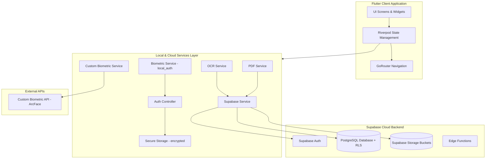

# CareSync 🏥

[](LICENSE)
[](https://flutter.dev)
[](https://supabase.com)
[](https://fastapi.tiangolo.com)
[](https://www.python.org)

CareSync is a highly secure, HIPAA-compliant, biometric-authenticated medical logging and electronic prescription application. It facilitates seamless and secure interactions between Patients, Doctors, Pharmacists, and First Responders. 

The platform features a custom, self-hosted facial recognition API powered by ArcFace and pgvector to securely identify patients and release life-saving medical data to first responders in emergency situations.

---

## 📖 Table of Contents
* [System Overview](#-system-overview)
* [Core Features](#-core-features)
* [Technology Stack](#-technology-stack)
* [Documentation Directory](#-documentation-directory)
* [Quick Start & Installation](#-quick-start--installation)
* [Environment Setup](#-environment-setup)
* [Testing & Quality Assurance](#-testing--quality-assurance)
* [Security & Compliance](#-security--compliance)
* [License](#-license)

---

## 🔍 System Overview

CareSync bridges patient confidentiality with immediate emergency medical responsiveness. 

In a medical crisis, seconds save lives. If a patient is unconscious or incapacitated, first responders need immediate access to critical medical history (allergies, chronic conditions, emergency contacts) without violating privacy regulations during normal operations. 

CareSync achieves this through a **dual-layer biometric verification system**:
1. **Local Biometrics (`local_auth`)**: Handles local authentication and session lock management.
2. **Cloud Biometrics (ArcFace + Supabase pgvector)**: Compiles 512-dimension vector representations from multi-pose face scans to identify patients in emergency settings.

---

## 🏗️ System Architecture


```mermaid
graph TD
    %% Frontend Applications %%
    subgraph Frontend [Flutter Client Application]
        UI[UI Screens & Widgets]
        RP[Riverpod State Management]
        Router[GoRouter Navigation]
    end

    %% Services Layer %%
    subgraph Services [Local & Cloud Services Layer]
        BS[Biometric Service - local_auth]
        AS[Auth Controller]
        SS[Secure Storage - encrypted]
        SbS[Supabase Service]
        AFS[Custom Biometric Service]
        PDF[PDF Service]
        OCR[OCR Service]
    end

    %% Backend Layer %%
    subgraph Backend [Supabase Cloud Backend]
        Auth[Supabase Auth]
        DB[(PostgreSQL Database + RLS)]
        Storage[(Supabase Storage Buckets)]
        EF[Edge Functions]
    end

    %% External APIs %%
    subgraph External [External APIs]
        Azure[Custom Biometric API - ArcFace]
    end

    %% Connections %%
    UI --> RP
    RP --> Router
    RP --> Services
    
    BS --> AS
    AS --> SS
    SbS --> Auth
    SbS --> DB
    SbS --> Storage
    
    AFS --> Azure
    
    OCR --> SbS
    PDF --> SbS
```

---

## 👥 Roles & Workflows

CareSync enforces Role-Based Access Controls (RBAC) to segment workflows across four user groups:


```mermaid
flowchart TD
    Start([User Logs In]) --> RoleCheck{Identify User Role}
    
    RoleCheck -->|Patient| PatientWF[Patient Workflow]
    RoleCheck -->|Doctor| DoctorWF[Doctor Workflow]
    RoleCheck -->|Pharmacist| PharmacistWF[Pharmacist WF]
    RoleCheck -->|First Responder| FRWF[First Responder WF]

    subgraph PatientWF [Patient Panel]
        P1[Register Biometrics / Face ID]
        P2[Track Vitals & Appointments]
        P3[Generate Emergency QR Code]
        P4[Upload & Manage Self-Entered Prescriptions]
    end

    subgraph DoctorWF [Doctor Panel]
        D1[Lookup Patients Securely]
        D2[Issue E-Prescription with Auto-Calculation]
        D3[Generate Signed PDFs]
        D4[Chat with Patients]
    end

    subgraph Pharmacist WF [Pharmacist Panel]
        Ph1[Lookup Prescriptions by Patient/ID]
        Ph2[Verify Doctor Signatures]
        Ph3[Mark Medicines as Dispensed]
        Ph4[View Dispensing History]
    end

    subgraph FRWF [Emergency Panel]
        F1[Scan Emergency QR Code]
        F2[Fallback offline decryption]
        F3[Access Critical Vitals & Allergies]
    end
```

---

## 💻 Technology Stack

* **Frontend**: [Flutter 3.7+](https://flutter.dev) (Dart client), [Riverpod](https://riverpod.dev) (state management), and [GoRouter](https://pub.dev/packages/go_router) (routing).
* **Backend BaaS**: [Supabase](https://supabase.com) (Auth, PostgreSQL DB, Realtime messaging, and Storage).
* **Biometrics API**: [FastAPI](https://fastapi.tiangolo.com) + [Uvicorn](https://www.uvicorn.org) (Python microservice).
* **AI Models**: ArcFace (via DeepFace) for facial embedding vectors and Google MediaPipe Face Mesh for pose landmarks.

---

## 📂 Documentation Directory

For detailed documentation, refer to the specialized sub-guides in the `docs/` folder:

* **[Documentation Index](file:///Users/zen/Documents/GitHub/CareSyncMain/docs/DOCUMENTATION_INDEX.md)**: Main Table of Contents mapping all guides.
* **[System Architecture](file:///Users/zen/Documents/GitHub/CareSyncMain/docs/SYSTEM_ARCHITECTURE.md)**: Ecosystem maps and cross-subsystem workflows.
* **[Flutter Client Architecture](file:///Users/zen/Documents/GitHub/CareSyncMain/docs/FLUTTER_ARCHITECTURE.md)**: Feature folder structure, Riverpod states, and routing.
* **[Backend Microservice Architecture](file:///Users/zen/Documents/GitHub/CareSyncMain/docs/BACKEND_ARCHITECTURE.md)**: FastAPI design, model preloading, and endpoints.
* **[Biometric Engine Deep-Dive](file:///Users/zen/Documents/GitHub/CareSyncMain/docs/BIOMETRIC_SYSTEM.md)**: Embedding generation math, MediaPipe pose calculation, and consensus scoring.
* **[Database Schema Audit](file:///Users/zen/Documents/GitHub/CareSyncMain/docs/DATABASE.md)**: ER diagrams, table schemas, triggers, indexes, and RPCs.
* **[API Reference](file:///Users/zen/Documents/GitHub/CareSyncMain/docs/API_REFERENCE.md)**: Request/Response payloads, headers, and Edge Functions parameters.
* **[Security & HIPAA Compliance](file:///Users/zen/Documents/GitHub/CareSyncMain/docs/SECURITY.md)**: JWTs, RLS rules, offline QR symmetric keys, and audit log immutability.
* **[Deployment & Infrastructure](file:///Users/zen/Documents/GitHub/CareSyncMain/docs/DEPLOYMENT.md)**: Dockerfiles, env var checklists, and Hugging Face space setups.
* **[Developer Onboarding Guide](file:///Users/zen/Documents/GitHub/CareSyncMain/docs/DEVELOPER_GUIDE.md)**: Local machine setup instructions, databases setup, and run scripts.
* **[Testing & Verification Plan](file:///Users/zen/Documents/GitHub/CareSyncMain/docs/TESTING.md)**: Running Flutter unit/widget tests and python validation suites.
* **[Troubleshooting Handbook](file:///Users/zen/Documents/GitHub/CareSyncMain/docs/TROUBLESHOOTING.md)**: Common build errors, database recursion fixes, and camera issues.

---

## 🚀 Quick Start & Installation

### Step 1: Clone the Repository
```bash
git clone https://github.com/ankurrera/CareSyncMain.git
cd CareSyncMain
```

### Step 2: Configure Environment Variables
Create a `.env` file in the project root:
```env
SUPABASE_URL=https://your-project-id.supabase.co
SUPABASE_ANON_KEY=your-anon-public-key
BIOMETRIC_API_URL=http://localhost:8000
HF_TOKEN=your-optional-huggingface-token
```

### Step 3: Run the Biometric API
1. Navigate to the `biometric_api` folder and activate a virtual environment:
   ```bash
   cd biometric_api
   python3 -m venv venv
   source venv/bin/activate
   ```
2. Install Python dependencies and run the server:
   ```bash
   pip install -r requirements.txt
   python download_models.py
   uvicorn main:app --reload --port 8000
   ```

### Step 4: Run the Flutter Client
```bash
flutter pub get
flutter run
```

---

## 🧪 Testing & Quality Assurance

* **Flutter Tests**:
  ```bash
  flutter test
  ```
* **Python Biometric Pipeline Tests**:
  ```bash
  cd biometric_api
  python -m unittest test_biometric_pipeline.py
  ```

---

## 🛡️ Security & HIPAA Compliance
* **Row-Level Security (RLS)**: Protects all tables in PostgreSQL.
* **Tamper-Proof Audit Logging**: Database triggers block any edits or deletions on `biometric_access_logs`.
* **15-Minute Auto-Lock**: Automatically locks the app session after 15 minutes of inactivity, requiring local biometric re-authentication.

---

## 📝 License
This project is licensed under the MIT License - see the [LICENSE](LICENSE) file for details.
