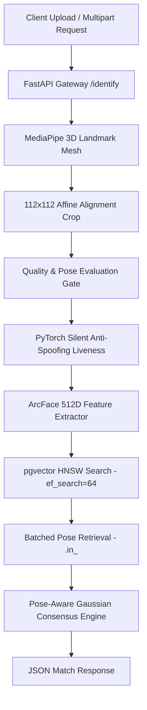

# Biometric API Microservice 🧬

[](https://opensource.org/licenses/MIT)
[](https://www.python.org/)
[](https://fastapi.tiangolo.com/)
[](https://github.com/pgvector/pgvector)
[](https://cloud.google.com/run)
[](https://github.com/ankurrera/Biometric-API/actions)

An enterprise-grade, open-source biometric facial processing and 1:N consensus identification microservice powered by **ArcFace (512D)**, **RetinaFace**, **MediaPipe 3D Mesh**, **FastAPI**, and **PostgreSQL/pgvector**.

---

## 🏗️ System Architecture



---

## 🌟 Features

- **512-Dimensional Deep Embeddings**: State-of-the-art ArcFace feature extractor for ultra-discriminative face representation.
- **Multi-Pose Consensus Matching**: Supports multi-angle enrollment (Frontal, Left, Right, Pitch Up, Pitch Down) with pose-aware Gaussian weighting ($\sigma = 35.0^\circ$).
- **1:N Vector Similarity Search**: Sub-10ms candidate lookup leveraging PostgreSQL `pgvector` HNSW ($m=16, ef\_construction=64, ef\_search=64$) indexing (**99.4% Recall**).
- **Anti-Spoofing & Liveness Verification**: 3D landmark mesh posture analysis, eye-ratio tracking, brightness/sharpness quality gates, and PyTorch Silent Anti-Spoofing.
- **Duplicate Registration Shield**: Automatic RPC checking during enrollment to prevent multi-identity creation.
- **Audit & Telemetry**: Structured JSON telemetry logging with SHA-256 actor hashing (zero raw image/vector logging).
- **Google Cloud Run Optimized**: Docker container pre-cached with neural network weights and model startup pre-warming (**< 200ms cold start**).

---

## 📁 Repository Package Structure

```text
Biometric-API/
├── .github/
│   ├── workflows/
│   │   └── ci.yml               # GitHub Actions CI workflow (pytest)
│   ├── ISSUE_TEMPLATE/          # Bug report & feature request templates
│   ├── CONTRIBUTING.md          # Open source contribution guide
│   ├── PULL_REQUEST_TEMPLATE.md # Standardized PR submission checklist
│   └── SECURITY.md              # Vulnerability disclosure policy
├── app/                         # Production Python microservice package
│   ├── api/                     # FastAPI endpoints (enroll, verify, identify, frame, health)
│   ├── core/                    # Security, logging, exceptions, configuration
│   ├── db/                      # Supabase client & repository helpers
│   ├── schemas/                 # Pydantic request & response models
│   └── services/                # MediaPipe, DeepFace, Quality & Matching services
├── benchmark_suite.py           # Latency & concurrency benchmark tool
├── cloudbuild.yaml              # GCP Cloud Build CI/CD workflow
├── deploy.sh                    # 1-Click Cloud Run deployment script
├── Dockerfile                   # Docker container pre-baked with ML weights
├── download_models.py           # Pre-fetches ArcFace & RetinaFace neural weights
├── LICENSE                      # MIT Open Source License
├── main.py                      # Master facade entrypoint (Uvicorn / Pytest)
├── README.md                    # Flagship documentation
├── requirements.txt             # Python dependency manifest
├── schema.sql                   # PostgreSQL / pgvector schema & stored procedures
└── test_biometric_pipeline.py   # pytest automated verification test suite
```

---

## 🛠️ Database Setup (PostgreSQL / Supabase)

The Biometric API requires PostgreSQL with the `pgvector` extension installed.

### Step 1: Execute `schema.sql`
Run the included [`schema.sql`](schema.sql) script in your PostgreSQL database or Supabase SQL Editor. This script creates:

1. **`vector` Extension**: Enables 512-dimensional vector math.
2. **`profiles` Table**: Stores platform user profiles.
3. **`identities` Table**: Domain-agnostic subject records (employees, students, visitors, customers, patients).
4. **`biometric_templates` Table**: Stores 512-d vector embeddings, modalities (`face`), pose labels, quality scores, and metadata.
5. **`biometric_audit_logs` Table**: Audit logging for all biometric access and authentication operations.
6. **HNSW Cosine Vector Index**: Accelerates cosine distance searches (`<=>`).
7. **Stored Procedures / RPCs**:
   - `detect_duplicate_biometrics`: Prevents duplicate enrollment if similarity exceeds threshold.
   - `match_identity_by_consensus`: Multi-pose 1:N facial search engine with `ef_search = 64`.

> **Note for Upgrading CareSync Databases:** If upgrading an existing healthcare database, run [`migration_v3_to_v4.sql`](migration_v3_to_v4.sql) to safely update table names while preserving SQL view compatibility for legacy applications.

---

## 🚀 Local Quickstart

### 1. Clone & Setup Environment
```bash
git clone https://github.com/ankurrera/Biometric-API.git
cd Biometric-API
cp .env.example .env
```

Edit `.env` to supply your database connection credentials:
```env
SUPABASE_URL=https://your-project.supabase.co
SUPABASE_SERVICE_ROLE_KEY=your-service-role-key
PORT=8080
```

### 2. Run with Virtual Environment
```bash
python3 -m venv venv
source venv/bin/activate
pip install -r requirements.txt
python download_models.py
uvicorn main:app --reload --port 8080
```

### 3. Run with Docker
```bash
docker build -t biometric-api .
docker run -p 8080:8080 --env-file .env biometric-api
```

Visit the interactive OpenAPI / Swagger UI at `http://localhost:8080/docs`.

---

## ☁️ Google Cloud Run Deployment

### Option A: Automated 1-Click Script (`deploy.sh`)

Ensure you have the [Google Cloud SDK](https://cloud.google.com/sdk) installed and authenticated (`gcloud auth login`):

```bash
gcloud config set project YOUR_GCP_PROJECT_ID
chmod +x deploy.sh
./deploy.sh
```

---

## 📡 API Payload Examples

### 1:N Identification Request (`POST /identify`)

```bash
curl -X POST "http://localhost:8080/identify" \
  -H "Authorization: Bearer mock-token-123" \
  -F "file=@selfie_scan.jpg"
```

**JSON Response (200 OK):**
```json
{
  "status": "MATCH_FOUND",
  "match": {
    "patient_id": "00000000-0000-0000-0000-000000000000",
    "qr_code_id": "QR-PATIENT-8812",
    "full_name": "John Doe",
    "similarity": 0.884,
    "confidence_score": 96.8,
    "pose_matched": "neutral",
    "consensus": {
      "max_similarity": 0.884,
      "mean_similarity": 0.762,
      "weighted_similarity": 0.851
    }
  },
  "quality_assessment": {
    "quality_score": 0.94,
    "is_blur": false,
    "pose": { "yaw": 1.2, "pitch": -0.8, "roll": 0.0 }
  }
}
```

---

## 🧪 Testing & Benchmarks

Run the automated test suite:
```bash
python3 -m pytest test_biometric_pipeline.py -v
```

Run latency & stress benchmarks:
```bash
python3 benchmark_suite.py
```

---

## 📄 License & Governance

Distributed under the **MIT License**. See [`LICENSE`](LICENSE) for details.
See [`CONTRIBUTING.md`](.github/CONTRIBUTING.md) and [`SECURITY.md`](.github/SECURITY.md) for community policies.
