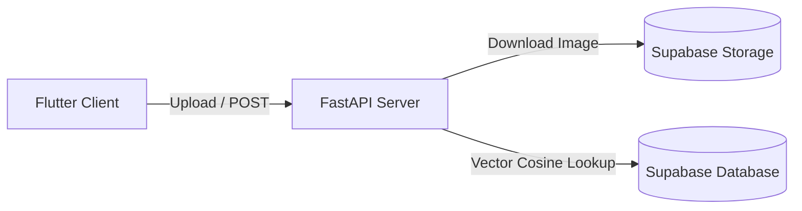
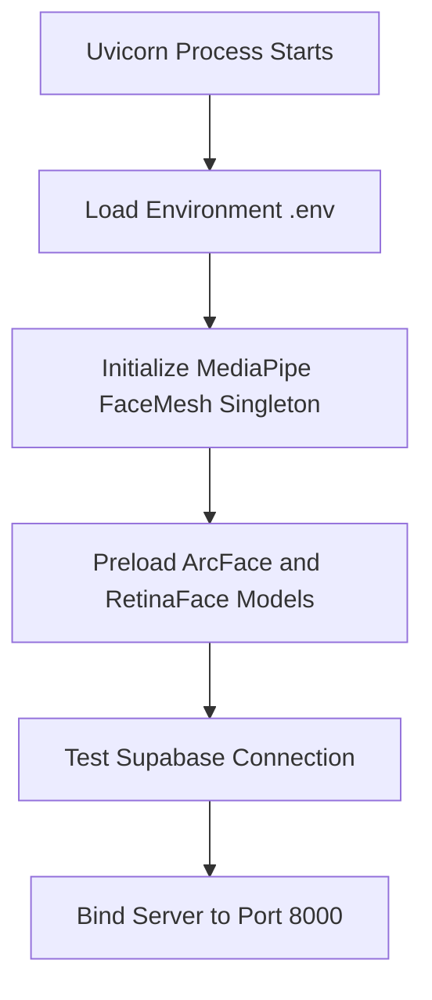

# Backend Microservice Architecture ⚙️

This document describes the FastAPI microservice configuration, server initialization sequence, model caching systems, and processing pipelines.

---

## 1. Role of the FastAPI Microservice

The custom Python FastAPI backend processes biometric media. It is separated from the database layer to keep computationally heavy tasks (like image processing, landmark calculation, and neural network evaluations) isolated from database transactions.

### Key Libraries & Frameworks
* **FastAPI + Uvicorn**: High-performance async request routing and response handling.
* **DeepFace (with ArcFace model)**: Handles embedding vector generation (512 float coordinates) and validation comparisons.
* **RetinaFace (Detector Backend)**: Performs robust face detection and bounding box alignment.
* **Google MediaPipe Face Mesh**: Extracts 468 3D landmarks for face pose calculation and alignment verification.
* **OpenCV (cv2)**: Image decoding, resizing, brightness mapping, and Laplacian blur checks.

---

## 2. Server Startup & Model Preloading

To avoid cold starts (which can add up to 5-10 seconds of latency during the first identification query), the server preloads all weights and sets up processing engines on startup:

### Preloading Optimization
During server start, a mock inference is run through `DeepFace.represent()` with a dummy image. This downloads and caches the model weight files (such as `arcface_weights.h5` and RetinaFace models) to the local `.deepface/weights` directory. In production environments, this is completed during Docker build execution (using `download_models.py`) to keep runtime starts fast.

---

## 3. Microservice Endpoints Reference

The FastAPI microservice exposes the following endpoints:

* **`GET /`**  
  Health-check endpoint. Returns status, model versions, and initialization flags.
* **`POST /enroll`**  
  Registers a new biometric profile pose. Receives a patient user ID, pose label, and image URL. Evaluates pose angles, liveness, and quality before writing to database.
* **`POST /verify_id`**  
  One-to-one verification comparing a patient's live selfie against their uploaded KYC ID document.
* **`POST /identify`**  
  One-to-many lookup. Generates a face embedding and performs consensus searching across registered patient vectors to identify an individual during emergencies.
* **`POST /analyze_frame`**  
  Real-time camera frame analyzer. Evaluates image quality, lighting, blur, and face pose to return guidance warnings for the guided scan.
* **`GET /diagnostics/mediapipe`**  
  Returns configuration and health details of the MediaPipe subsystem.

---

## 4. Operational Controls & Caching

### Token Authorization
All request headers are checked by a token validator dependency (`verify_token`). It compares the incoming `Authorization: Bearer <token>` against the environment variable `HF_TOKEN`. If `HF_TOKEN` is not set in development environments, warnings are logged and auth is bypassed.

### Rate Limiting
To prevent denial of service (DoS) attacks on neural processing nodes, endpoints are limited in memory:
* `/enroll`: 10 requests per minute.
* `/identify` / `/verify_id`: 15 requests per minute.

IP addresses or user IDs that exceed these parameters are rejected with `HTTP 429 Rate Limit Exceeded`.

### TTL Session Scan Cache (`SimpleTTLCache`)
In emergency situations, responders may resend requests or refresh views. To avoid repeat database vector evaluations, the server caches identification matches in memory:
* Caching uses the client IP address as the key.
* Expire timeframe (TTL) is set to **300 seconds (5 minutes)**.
* Any request within this window bypasses the deep search pipeline and returns immediately.

### Structured Logging (Sprint 3 Landmark)
The microservice implements a structured JSON logger configuration. This logger writes application event logs, system statistics, and exception stack traces in a machine-readable JSON format, facilitating sync with external monitoring and auditing agents (e.g. Google Cloud Logging, Grafana Loki).
