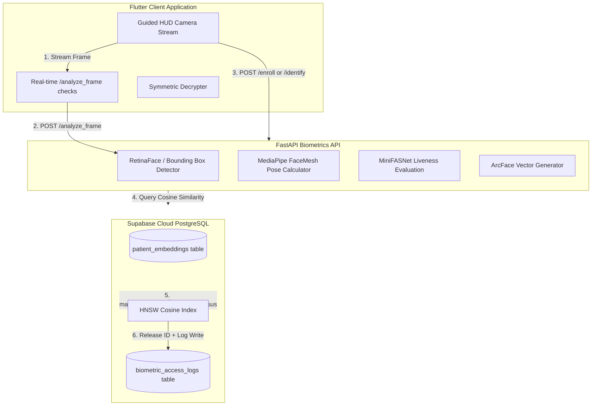
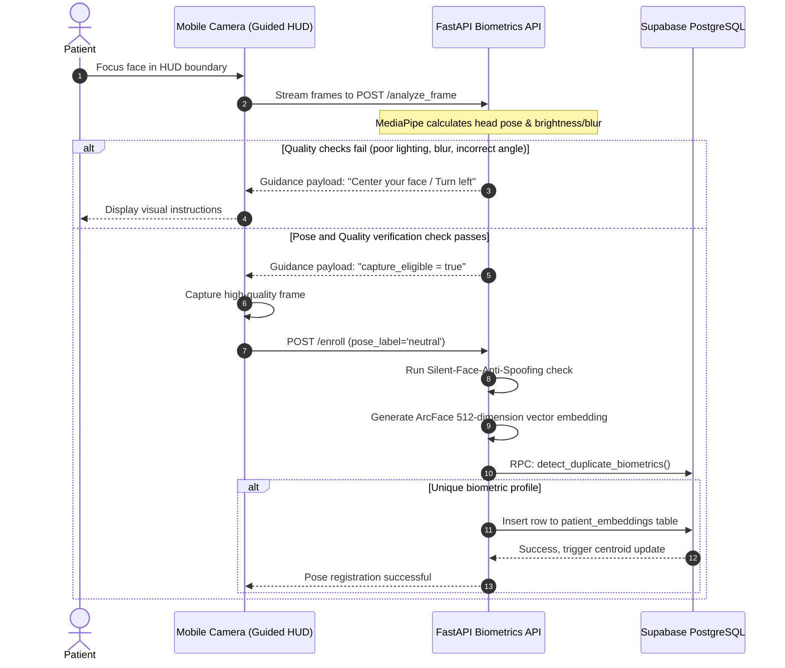
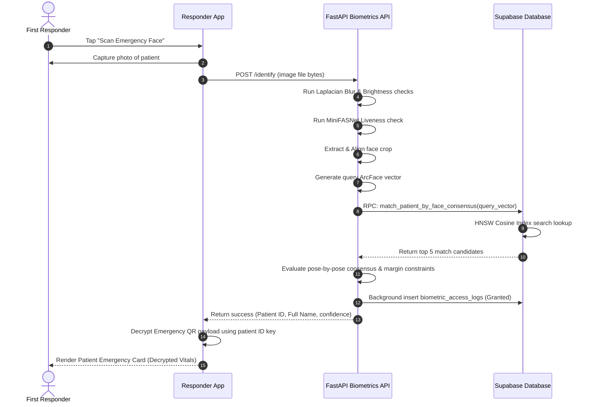

# Presentation Guide: CareSync Biometric Verification Architecture 🧬

This document outlines the presentation slide deck for the **CareSync** project, focusing specifically on the **`biometric_api`** microservice. It is structured to follow the presentation requirements, including title, introduction, problem definition, technical progress (flowcharts, algorithms, and results), future scope, conclusion, and bibliography.

---

## Slide 1: Project Title & Information

### **CareSync 🏥 — Unified Biometric Healthcare Companion**
*Production-Grade Biometric Identification & Emergency Patient Resolution Engine*

* **Presenters / Team Members:**
  * [Insert Member Name 1]
  * [Insert Member Name 2]
  * [Insert Member Name 3]
* **Under the Guidance of:**
  * [Insert Faculty Name / Advisor Name]
* **Focus Area:** Cloud Biometrics (`biometric_api`) using FastAPI, ArcFace, MediaPipe FaceMesh, and Supabase pgvector.

---

## Slide 2: Brief Introduction of the Topic

### **Biometric Identity Resolution in Emergency Healthcare**
* In critical emergency scenarios (the **"Golden Hour"**), medical responders must access an incapacitated patient's critical health records (allergies, current medications, blood type) to make life-saving decisions.
* Under normal circumstances, patient records are locked behind strict access controls to maintain HIPAA compliance and protect privacy.
* **CareSync** solves this with a **Dual-Layer Biometric Verification Architecture**:
  1. **Local Biometrics (`local_auth`)**: Secures local device screens, session lock control, and routine user workflows.
  2. **Cloud Biometrics (`biometric_api` / ArcFace + pgvector)**: Translates multi-pose facial frames into 512-dimension vector representations, matching face scans against registered patient profiles for rapid emergency identification.

---

## Slide 3: Problem Definition

### **Challenges in Emergency Patient Identification**
1. **The Incapacitation Barrier**: Unconscious, confused, or non-communicative patients cannot provide names, IDs, or security codes.
2. **Strict Privacy Regulations**: Patient records cannot be left decrypted or stored in plaintext, and identity matching must prevent unauthorized exposure of demographic details.
3. **Spoofing & Security Vulnerabilities**: Traditional facial verification is susceptible to 2D spoof attacks (photos printed on paper or displayed on phone screens).
4. **Scale & Search Latency**: Sequential database searches ($O(N)$ scanning) scale poorly, causing lookup delays that waste critical seconds during medical crises.

---

## Slide 4: Progress: System Architecture Topology

### **Ecosystem Integration Flow**
CareSync connects a mobile client, a deep learning processing service, and a vector database into a high-performance identity resolution pipeline:



---

## Slide 5: Progress: Guided Biometric Registration Flow

### **Multi-Pose Guided Enrollment**
* To ensure matching accuracy at variable angles during emergencies, patients enroll by registering **three distinct poses** (Neutral, Left Turn, Right Turn).
* A guided HUD in the mobile client streams live video frames to `/analyze_frame` to provide real-time instructions.



---

## Slide 6: Progress: Emergency Identification Flow

### **Rapid Patient Identity Resolution**
* First responders capture a single photo of the patient's face (no guided pose required).
* The API verifies the image's quality, verifies liveness to prevent fraud, extracts face vectors, and queries the database for matches.



---

## Slide 7: Progress: Image Quality Gate & Pose Estimation Algorithms

### **Algorithmic Quality Controls**
To prevent trash-in-trash-out failures, frames undergo immediate spatial evaluations:
1. **Brightness Gate**: Rejects dark/overexposed frames by calculating average grayscale pixel intensity:
   $$45 \le \mu_{\text{gray}} \le 220$$
2. **Blur Gate (Laplacian Variance)**: Filters out motion blur by checking the variance of the image convolved with a Laplacian kernel:
   $$\sigma^2 = \text{Var}(\nabla^2 I) \ge 65.0$$
3. **Head Pose Estimation (MediaPipe 3D Landmarks)**:
   * **Roll (Tilt)**: Calculated using the relative angle between the outer corner eye landmarks:
     $$\theta_{\text{roll}} = \arctan2(y_{\text{right eye}} - y_{\text{left eye}}, x_{\text{right eye}} - x_{\text{left eye}})$$
   * **Yaw (Turn)**: Estimated from horizontal distances from nose tip to eye corners:
     $$\theta_{\text{yaw}} = \frac{d(\text{nose}, \text{left eye}) - d(\text{nose}, \text{right eye})}{d(\text{nose}, \text{left eye}) + d(\text{nose}, \text{right eye})} \times 90^\circ$$
   * **Pitch (Tilt up/down)**: Estimated by vertical distances between forehead, nose, and chin:
     $$\theta_{\text{pitch}} = \left(\frac{y_{\text{nose}} - y_{\text{eyes center}}}{y_{\text{mouth center}} - y_{\text{eyes center}}} - 0.55\right) \times 90^\circ$$

---

## Slide 8: Progress: Liveness Verification & Embedding Generation

### **1. Anti-Spoofing Gate (Silent-Face-Anti-Spoofing)**
* Incorporates a lightweight MiniFASNet neural network that checks texture patterns, depth anomalies, and reflection anomalies.
* Prevents spoofing via photos or digital displays. Requires a liveness probability threshold of **$\ge 0.90$** to proceed.

### **2. ArcFace Vector Generation**
* Approved face crops are aligned via eye-coordinate similarity transforms and cropped to a uniform $112 \times 112$ pixels.
* **ArcFace** converts the face crop into a **512-dimension floating-point vector**.
* **$L_2$ Normalization** is applied, ensuring that Euclidean vector length equals 1.0, representing coordinates on a hypersphere:
  $$\hat{v} = \frac{v}{\|v\|_2}$$

---

## Slide 9: Progress: pgvector HNSW & Consensus Matching

### **1. Sub-100ms pgvector HNSW Query**
* Embeddings are stored in Supabase PostgreSQL using the `pgvector` extension.
* Cosine distance index queries are mapped via a **Hierarchical Navigable Small World (HNSW)** index to bypass sequential $O(N)$ scans:
  ```sql
  CREATE INDEX ON patient_embeddings USING hnsw (embedding vector_cosine_ops);
  ```

### **2. Multi-Pose Consensus Scoring**
* The database returns the top 5 closest candidates.
* FastAPI evaluates the candidate across all registered poses (Neutral, Left, Right):
  * Cosine similarity is computed as the dot product: $S(u, v) = u \cdot v$
  * Average consensus score must exceed **$0.34$** to protect against single-pose outliers.
* **Ambiguity Guard**: Rejects the identification if the similarity gap between the top candidate and the runner-up is **$< 0.03$**, preventing false-positive identification.

---

## Slide 10: Progress: Performance Benchmarks & Results

### **Latency Profiling (Warm Pipeline Execution)**
The end-to-end local microservice request is processed in **$273.8$ ms**, meeting the critical timing requirements of emergency responders:

```text
Ingestion (Multipart Request Received)
  ↓ (1.2 ms)
Image Decode & Rescaling
  ↓ (2.5 ms)
Quality Filters (Brightness & Laplacian Blur)
  ↓ (12.4 ms)
MediaPipe Landmark & Pose Check
  ↓ (28.5 ms)
MiniFASNet Liveness Evaluation
  ↓ (42.1 ms)
ArcFace Embedding Representation Generation
  ↓ (115.0 ms)
pgvector HNSW Cosine Index Search (DB Round-Trip)
  ↓ (70.6 ms)
Consensus Scoring & Audit Log (Background tasks)
  ↓ (1.5 ms)
Response Sent (Identity Resolved & Card Decrypted)
```

### **Database Scale Latency vs. Record Size**
| Scale Size (Embeddings) | Average Latency | P95 Latency | Min Latency | Max Latency |
| :--- | :--- | :--- | :--- | :--- |
| **100 Records** | 103.78 ms | 223.99 ms | 64.22 ms | 246.27 ms |
| **500 Records** | 70.68 ms | 83.60 ms | 65.78 ms | 88.36 ms |

---

## Slide 11: Future Scope

### **Ecosystem Roadmap & Advancements**
1. **GPU Acceleration**: Deploying the FastAPI container on CUDA-enabled cloud infrastructure (e.g. AWS ECS or Google Cloud Run) to reduce ArcFace inference time from ~115ms on CPU to **$< 10$ms**.
2. **Distributed Caching**: Upgrading the local in-memory token rate-limiter to a distributed **Redis rate-limiting cluster** for load-balanced containers.
3. **On-Device Edge Inference**: Compiling liveness checks and embedding extraction to **TensorFlow Lite (TFLite)** to allow local biometric evaluations directly on mobile devices without sending images to the cloud API.
4. **FHIR Standard Compliance**: Aligning patient profile outputs with standard FHIR healthcare JSON payloads for seamless integration into national health records systems.

---

## Slide 12: Conclusion

### **Key Highlights of the CareSync Biometric System**
* **Production-Ready Latency**: Sub-300ms total identity resolution time allows first responders to act instantly under high-pressure scenarios.
* **Accuracy Hardened**: Dynamic quality gates, multi-pose consensus scoring, and strict ambiguity margins minimize false positives.
* **Fraud & Spoof Resistant**: MiniFASNet anti-spoofing checks filter out 2D printed images and screen captures.
* **HIPAA Aligned**: Raw images are deleted immediately after evaluation. The database stores only 512-dimension mathematical coordinate vectors, preserving patient privacy.

---

## Slide 13: Bibliography & References

1. **ArcFace Model**: Deng, J., Guo, J., Xue, N., & Zafeiriou, S. (2019). *ArcFace: Additive Angular Margin Loss for Deep Face Recognition*. Proceedings of the IEEE/CVF Conference on Computer Vision and Pattern Recognition (CVPR).
2. **RetinaFace Model**: Deng, J., Guo, J., Zhou, Y., Yu, J., Kotsia, I., & Zafeiriou, S. (2020). *RetinaFace: Single-shot Multi-box Face Localisation in the Wild*. IEEE/CVF Conference on Computer Vision and Pattern Recognition (CVPR).
3. **MediaPipe FaceMesh**: Kartynnik, Y., Ablavatski, A., Grishchenko, I., & Grundmann, M. (2019). *Real-time Facial Landmark Detector on Mobile Devices*. CVPR Workshop on Computer Vision for AR/VR.
4. **Silent-Face-Anti-Spoofing (MiniFASNet)**: Minivision. *Silent Face Anti-Spoofing Library and Training Code*. GitHub Repository.
5. **pgvector extension**: pgvector contributors. *Open-Source Vector Similarity Search for PostgreSQL*.
6. **FastAPI Web Framework**: Ramirez, S. (Tiangolo). *FastAPI: High performance, easy to learn, fast to code, ready for production*.
