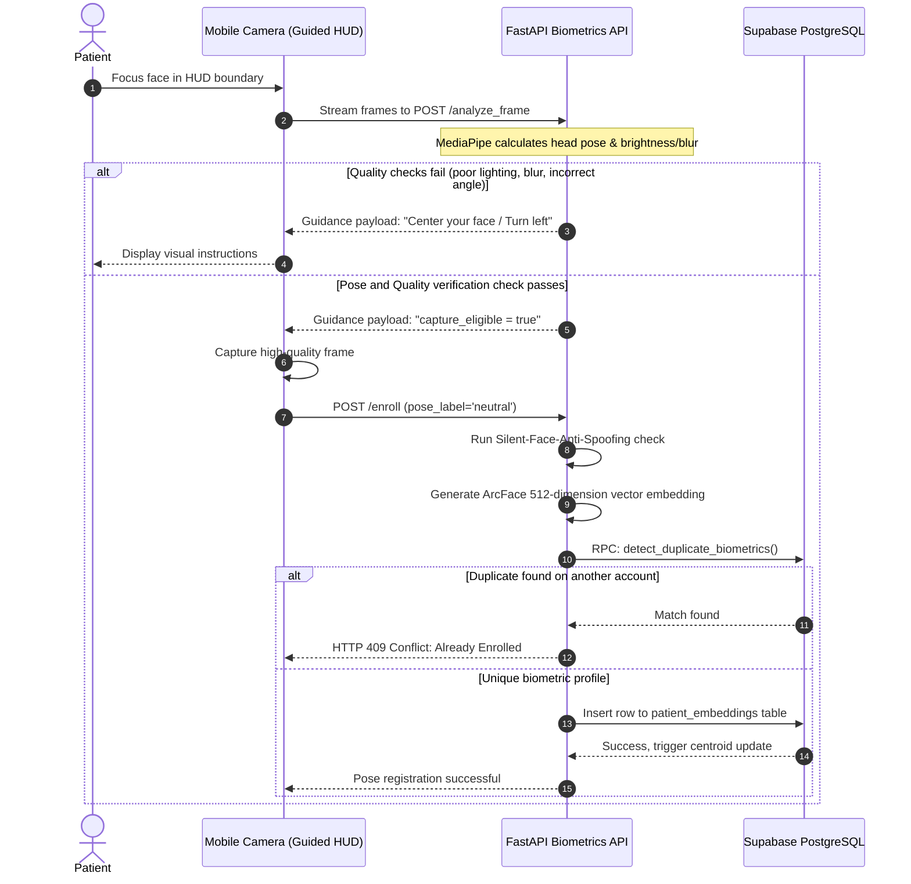
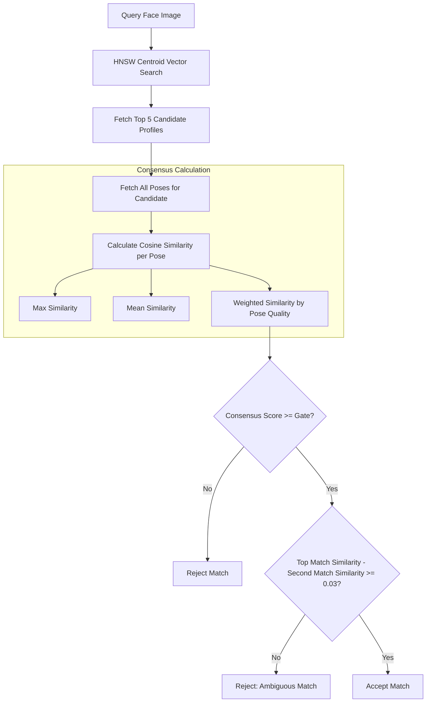

# Biometric System & Consensus Verification 🧬

This document provides a deep technical breakdown of the CareSync biometric engine, including guided enrollment, image validation, MediaPipe pose calculation, PyTorch-based liveness verification, and pgvector HNSW consensus matching.

---

## 1. Guided Enrollment & Matching Pipeline

The biometrics lifecycle covers two operations: **Multi-pose Enrollment** and **Emergency Identification**.

### Enrollment Pipeline Flow
During patient registration, the application guides the user through capturing three distinct poses (Neutral, Left turn, Right turn) to register their face footprint:



---

## 2. Face Pose Estimation (MediaPipe 3D Landmarks)

To prevent spoofing via static photographs, CareSync calculates head position dynamically using 3D coordinates from MediaPipe Face Mesh:

* **Roll (Tilt left/right)**: Calculated using the relative angle between the outer corner eye landmarks:
  $$\theta_{\text{roll}} = \arctan2(y_{\text{right eye}} - y_{\text{left eye}}, x_{\text{right eye}} - x_{\text{left eye}})$$
* **Yaw (Turn left/right)**: Estimated from the ratio of horizontal distances from the nose tip to each eye outer corner landmark:
  $$\text{Ratio} = \frac{d(\text{nose}, \text{left eye}) - d(\text{nose}, \text{right eye})}{d(\text{nose}, \text{left eye}) + d(\text{nose}, \text{right eye})}$$
  $$\theta_{\text{yaw}} = \text{Ratio} \times 90^\circ$$
* **Pitch (Tilt up/down)**: Estimated by calculating the ratio of the vertical distance from eyes to nose relative to eyes to mouth:
  $$\text{Ratio} = \frac{y_{\text{nose}} - y_{\text{eyes center}}}{y_{\text{mouth center}} - y_{\text{eyes center}}}$$
  $$\theta_{\text{pitch}} = (\text{Ratio} - 0.55) \times 90^\circ$$

### Dynamic Guidance Thresholds
A captured frame must meet specific angles to qualify for pose enrollment:
* **Neutral Pose**: $|\theta_{\text{yaw}}| \le 22^\circ$ and $|\theta_{\text{pitch}}| \le 18^\circ$
* **Left Angle Turn**: $\theta_{\text{yaw}} \le -15^\circ$
* **Right Angle Turn**: $\theta_{\text{yaw}} \ge 15^\circ$

---

## 3. Real-time Image Quality Gate

Frames are evaluated before processing to ensure high accuracy:
1. **Brightness Gate**: Checks that the average pixel intensity of the face area falls in a standard range:
   $$45 \le \mu_{\text{gray}} \le 220$$
2. **Blur Gate (Laplacian Variance)**: Filters out blurred frames by ensuring the variance of the Laplacian operator is above the threshold:
   $$\text{Var}(\text{Laplacian}(img)) \ge 65.0$$
3. **Occlusion Checks**: Detects if sunglasses or masks cover face coordinates.

---

## 4. ArcFace Embeddings & pgvector HNSW Search

Approved face crops are passed to the **ArcFace** model:
* **Hyperspherical Mapping**: Maps the face to a **512-dimension coordinate vector**.
* **$L_2$ Normalization**: Ensures that distance calculations correspond to cosine similarities:
  $$\hat{v} = \frac{v}{\|v\|_2}$$

### pgvector HNSW Indexing
Vector lookups leverage a Hierarchical Navigable Small World (HNSW) index on `patient_embeddings` table to ensure sub-50ms query execution:
```sql
CREATE INDEX IF NOT EXISTS idx_patient_embeddings_vector 
ON patient_embeddings USING hnsw (embedding vector_cosine_ops);
```

Cosine distance ($d$) is computed as:
$$d(u, v) = 1 - u \cdot v$$

---

## 5. Multi-Pose Consensus Scoring

To identify patient profiles with high confidence while avoiding false positives, CareSync implements a two-stage verification process:



### Metrics & Thresholds
1. **Calibrated Confidence**: Cosine similarity values ($S$) map to human-readable percentages:
   $$C = \text{Clamp}( (S - 0.20) \times 166.6, \ 0.0, \ 100.0 )$$
2. **Ambiguity Guard**: Rejects the identification if the difference in cosine similarity between the top-scoring candidate and the runner-up is **less than 0.03**.
3. **Liveness Gate**: Checks face texture and depth features via Silent-Face-Anti-Spoofing. Rejects frames with liveness score below **0.90**.
