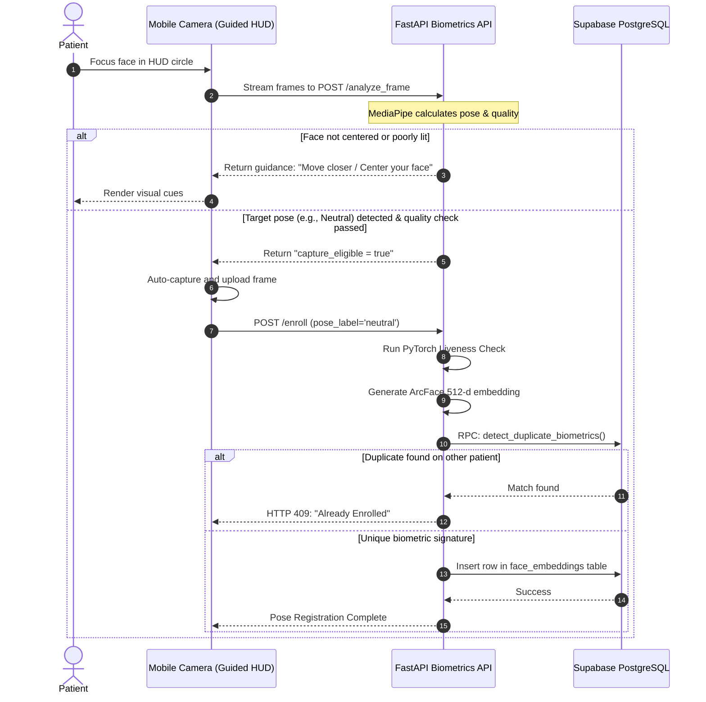
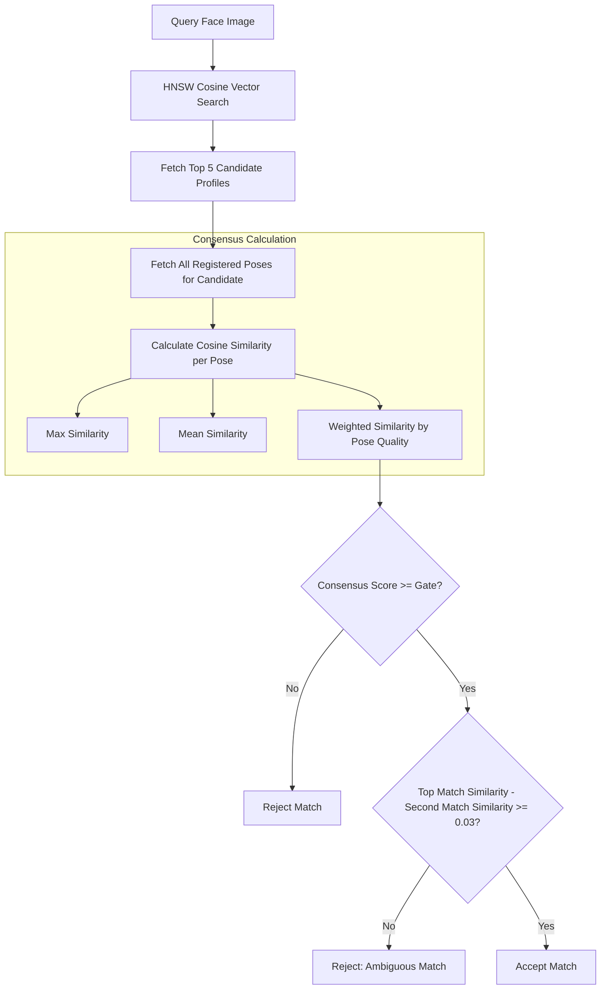

# Biometric System & Consensus Verification 🧬

This document provides a deep technical explanation of the CareSync biometric engine, detailing enrollment, recognition, pose calculation, liveness validation, and consensus matching.

---

## 1. Biometric Pipeline Lifecycle

The biometric engine handles enrollment (registering verified poses) and identification (emergency lookup).

### Enrollment Lifecycle
During patient registration, the app guides the patient through capturing **multi-pose scans** (Neutral, Left turn, Right turn) to build a robust biometric profile.



---

## 2. Face Pose Estimation (MediaPipe 3D Landmarks)

To ensure high-quality enrollment and prevent static image spoofing, CareSync verifies head angles in real-time. The server uses 3D landmarks from MediaPipe Face Mesh:

* **Roll (tilt left/right)**: Calculated by comparing the horizontal angle between the centers of the left and right eyes:
  $$\theta_{\text{roll}} = \arctan2(y_{\text{right eye}} - y_{\text{left eye}}, x_{\text{right eye}} - x_{\text{left eye}})$$
* **Yaw (turn left/right)**: Calculated from the ratio of distances from the nose tip to each eye outer corner:
  $$\text{Ratio} = \frac{d(\text{nose}, \text{left eye}) - d(\text{nose}, \text{right eye})}{d(\text{nose}, \text{left eye}) + d(\text{nose}, \text{right eye})}$$
  $$\theta_{\text{yaw}} = \text{Ratio} \times 90^\circ$$
* **Pitch (tilt up/down)**: Calculated by measuring the ratio of the vertical nose distance relative to the total height of the face (eyes to mouth distance):
  $$\text{Ratio} = \frac{y_{\text{nose}} - y_{\text{eyes center}}}{y_{\text{mouth center}} - y_{\text{eyes center}}}$$
  $$\theta_{\text{pitch}} = (\text{Ratio} - 0.55) \times 90^\circ$$

### Dynamic Guidance Thresholds
During the guided scan, frames must meet specific angle constraints to qualify:
* **Neutral**: $|\theta_{\text{yaw}}| \le 22^\circ$ and $|\theta_{\text{pitch}}| \le 18^\circ$
* **Left**: $\theta_{\text{yaw}} \le -15^\circ$
* **Right**: $\theta_{\text{yaw}} \ge 15^\circ$

---

## 3. Image Quality Gate

Before computing embeddings, images pass through an OpenCV quality pipeline:
1. **Brightness Gate**: The average pixel value must fall between **45 and 220** on a 0-255 grayscale conversion:
   $$45 \le \mu_{\text{gray}} \le 220$$
2. **Blur Gate (Laplacian Variance)**: High frequency spatial variance is evaluated. A threshold below **65.0** rejects the frame to prevent blurry inputs:
   $$\text{Var}(\text{Laplacian}(img)) \ge 65.0$$
3. **Occlusion Checks**: Eye and mouth bounding regions are evaluated for low light standard deviations (shades indicating masks or sunglasses).

---

## 4. ArcFace Embedding & Vector Search (pgvector)

Once a frame passes the quality checks, the cropped face is evaluated using **ArcFace**:
* ArcFace maps the face image to a **512-dimension hyperspherical coordinate space**.
* The vector represents structural facial features.
* The output vector is $L_2$ normalized to ensure distance calculations are based purely on angles:
  $$\hat{v} = \frac{v}{\|v\|_2}$$

### pgvector HNSW Cosine Similarity Index
In the Supabase database, face embeddings are stored as a `vector(512)` type. Lookups use a Hierarchical Navigable Small World (HNSW) index using cosine distance:
```sql
CREATE INDEX idx_face_embeddings_vector 
ON public.face_embeddings USING hnsw (embedding vector_cosine_ops);
```
Cosine distance is defined as:
$$d_{\text{cosine}}(u, v) = 1 - \frac{u \cdot v}{\|u\|_2 \|v\|_2}$$
For normalized vectors, this simplifies to:
$$d_{\text{cosine}}(u, v) = 1 - u \cdot v$$

---

## 5. Multi-Pose Consensus Verification

To identify patient profiles with high confidence while avoiding false positives, CareSync implements a two-stage verification process:

### Stage 1: Vector Candidate Retrieval
The server invokes the database RPC `match_patient_by_face_consensus` to fetch the top 5 candidate profiles that are within the adaptive distance threshold.

### Stage 2: Python Consensus Checks
For each candidate profile, the server retrieves all active registered poses (up to 4 poses: neutral, left, right, smile) and calculates the similarity against the query image:



### Metrics & Thresholds
1. **Calibrated Confidence**: Convert the cosine similarity score ($S$) to a percentage-based confidence level ($C$):
   $$C = \text{Clamp}( (S - 0.20) \times 166.6, \ 0.0, \ 100.0 )$$
2. **Ambiguity Guard**: Rejects matches if the gap between the top identified candidate and the runner-up is **less than 0.03**. This prevents misidentifications in populations with high feature similarity.
3. **Liveness Gate**: When PyTorch is available, the Silent-Face-Anti-Spoofing pipeline evaluates the texture and depth of the face. Frames with a liveness confidence score below **0.90** are marked as spoofing attempts and rejected.
