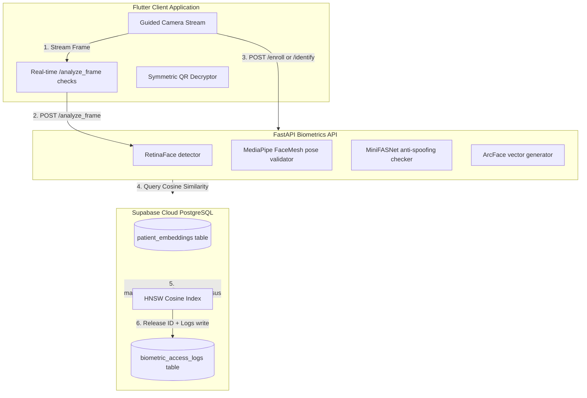
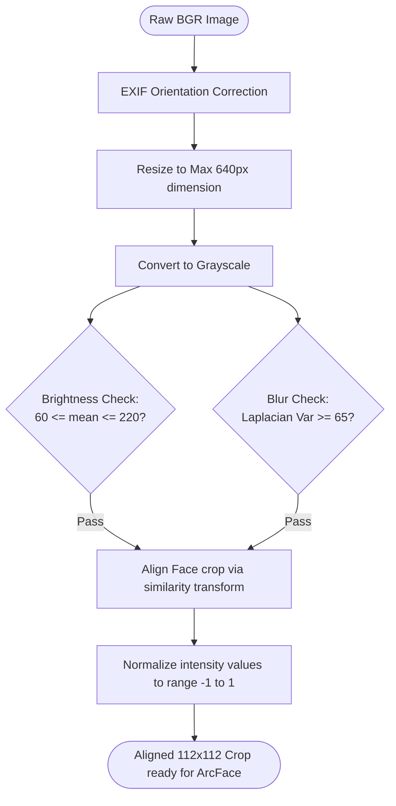
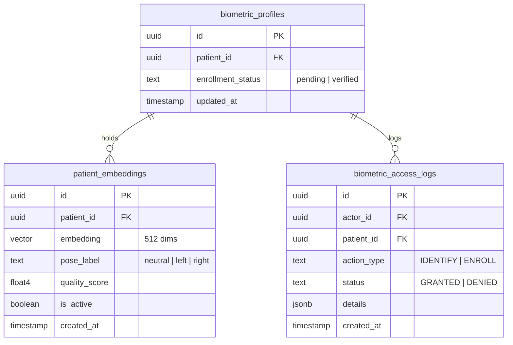
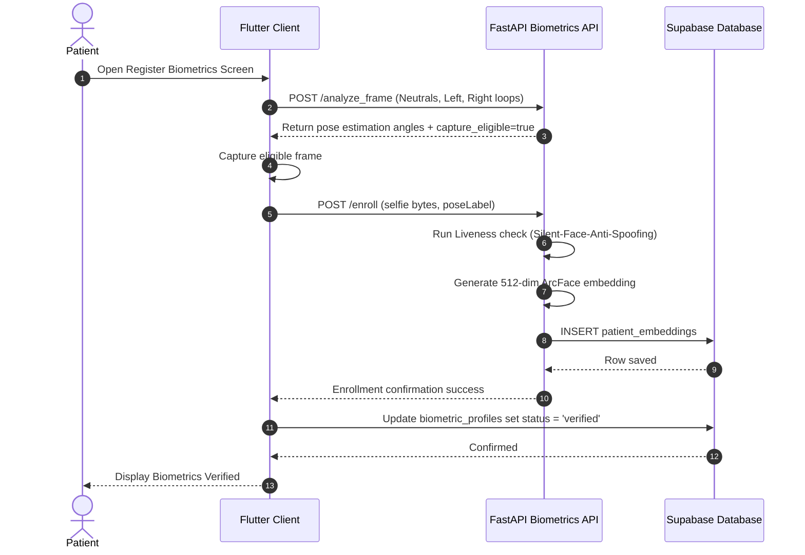
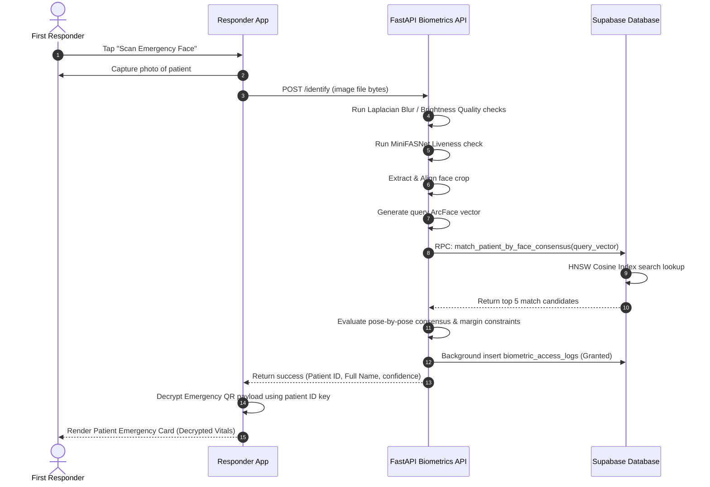

# CareSync Biometric Workflow Guide 🧬

This document provides a comprehensive technical overview of the CareSync Biometric Identification Engine. It describes the end-to-end lifecycle of facial registration, quality screening, pose checking, liveness verification, embedding generation, consensus vector search, and database integration.

---

## 1. Overview & Architecture Topology

CareSync leverages facial biometrics to resolve patient identities in emergency "break glass" scenarios where the patient is unconscious or unable to provide demographic identifiers. 

The biometrics subsystem is split into three main tiers:
1. **Flutter Client**: Guided UI capturing frames, validating quality in real-time, displaying feedback, and submitting payloads.
2. **FastAPI Microservice**: Deep learning execution node performing face detection, pose estimation, anti-spoofing liveness checks, and 512-dimension embedding generation.
3. **Supabase Database**: Storing Normalized embeddings, executing cosine distance lookups via the `pgvector` HNSW index, and writing immutable access logs.



---

## 2. Complete Registration Flow

The registration flow enrolls a patient by collecting three separate poses (Neutral, Left, and Right). This multi-pose strategy ensures that emergency scans taken from angled views can be matched correctly.

```text
Patient Opens Profile Settings 
  ↓
Navigate to "Register Biometrics" (Guided KYC verification check)
  ↓
Camera opens in Flutter UI (displays circular frame overlay)
  ↓
Flutter captures camera frames sequentially at 15 FPS
  ↓
For each frame, Flutter calls POST /analyze_frame (pre-scan)
  ↓
FastAPI receives frame, decodes BGR bytes, and resizes dimension to max 640px
  ↓
Evaluate Brightness (Low light < 60, Overexposed > 220 checks)
  ↓
Evaluate Focus (Laplacian Variance < 65.0 check)
  ↓
MediaPipe FaceMesh detects landmarks and calculates Yaw, Pitch, Roll angles
  ↓
Verify current pose matches target pose (Neutral, Left turn, Right turn)
  ↓
If pose matches and quality scores exceed limits, return capture_eligible = true
  ↓
Flutter displays green border and captures the frame
  ↓
Flutter uploads image to Supabase 'kyc-documents' storage bucket
  ↓
Flutter calls POST /enroll with selfieUrl & poseLabel ('neutral', 'left', 'right')
  ↓
FastAPI downloads selfie, runs liveness (Anti-Spoofing), extracts face crop, and runs ArcFace
  ↓
Generates 512-dimension vector embedding (L2 normalized)
  ↓
Duplicate Biometric Check: RPC detect_duplicate_biometrics executes lookup
  ↓
Insert embedding into 'patient_embeddings' table with pose_label & quality_score
  ↓
Repeat for Left and Right poses
  ↓
Update 'biometric_profiles' status to 'verified'
```

---

## 3. Complete Recognition Flow

Emergency responders scan a patient's face to access their medical record in the field without internet query delays if they scan a QR payload, or via the cloud database lookup if online.

```text
Responder selects "Scan Emergency Face" in Responder App
  ↓
Camera UI opens and captures patient's face (no pose guide active)
  ↓
Flutter calls POST /identify with raw JPEG image bytes
  ↓
FastAPI receives file bytes and runs evaluate_image_quality (warm models)
  ↓
FastAPI checks rate limiting (identify_limiter window checks)
  ↓
MediaPipe / RetinaFace detects bounding box of face
  ↓
MiniFASNet evaluates depth/texture map for liveness check (rejects 2D photos)
  ↓
Face alignment is performed using eye coordinate similarity transforms
  ↓
ArcFace generates 512-dimension L2-normalized vector embedding
  ↓
Stage 1 Database Match: RPC match_patient_by_face_consensus is called (max_distance = 0.40)
  ↓
Supabase pgvector HNSW index queries the top 5 closest candidates
  ↓
Stage 2 Python Consensus Verification: 
  - For each candidate, fetch all enrolled active poses (Neutral, Left, Right)
  - Compute dot products (cosine similarity) between query vector and enrolled vectors
  - Calculate max_similarity, mean_similarity, and quality-weighted similarity
  ↓
Sort candidates by similarity. Ensure top candidate exceeds dynamic quality gate:
  - Similarity >= (1.0 - adaptive_max_distance)
  - Mean similarity across all poses >= 0.34
  ↓
Ambiguity Margin Guard Check: 
  - Similarity difference between top match and runner-up must exceed 0.03
  - If margin is less, raise HTTP 400 LOW_CONFIDENCE to prevent false matching
  ↓
Calibrate Match Confidence Score (percentage mapping)
  ↓
Write entry to 'biometric_access_logs' (Audit trail)
  ↓
FastAPI returns success response with patient ID and QR key details
  ↓
Flutter client decrypts patient vitals card and releases medical profile
```

---

## 4. Models Used

| Model | Purpose | Input | Output | Used During | File Reference |
| :--- | :--- | :--- | :--- | :--- | :--- |
| **RetinaFace** | Single-face bounding box and keypoint detection | $640 \times 480$ BGR Image | Bounding box coordinates, 5 facial landmarks | Enrollment, Identification (Fallback) | [main.py](file:///Users/zen/Documents/GitHub/CareSyncMain/biometric_api/main.py) |
| **MediaPipe FaceMesh** | Real-time Landmark Mapping & Head Pose Yaw/Pitch/Roll calculations | $640 \times 480$ BGR Image | 468 3D facial landmarks | Frame Analysis, Enrollment | [main.py](file:///Users/zen/Documents/GitHub/CareSyncMain/biometric_api/main.py) |
| **MiniFASNet (v1/v2)** | Silent-Face-Anti-Spoofing liveness check | $80 \times 80$ cropped face | Probability scores for Real vs. Spoof | Enrollment, Identification | [main.py](file:///Users/zen/Documents/GitHub/CareSyncMain/biometric_api/main.py) |
| **ArcFace** | 512-dimension representation embedding vector generation | $112 \times 112$ aligned crop | 512 floating-point values | Enrollment, Identification | [main.py](file:///Users/zen/Documents/GitHub/CareSyncMain/biometric_api/main.py) |

### Model Selection Rationale
* **RetinaFace**: Chosen over Haar Cascades and MTCNN due to its high localization accuracy under low lighting, occlusions, and severe head tilts.
* **MediaPipe FaceMesh**: Evaluated locally in <15ms on CPU. The dense landmarks allow head pose calculations without loading heavy convolutional networks.
* **MiniFASNet**: Extremely lightweight anti-spoofing model using dual-band classification to prevent screen and print attacks without requiring depth cameras.
* **ArcFace**: Outperforms FaceNet by applying additive angular margin loss, generating a highly discriminative 512-dimension vector space optimized for cosine similarity comparisons.

---

## 5. Image Processing Pipeline

Every image passing through the biometric service undergoes sequential spatial conversions before entering deep learning estimators:



1. **Orientation Correction**: Reads EXIF flags to transpose images captured sideways on mobile cameras.
2. **Dynamic Rescaling**: Resizes images to a maximum dimension of 640 pixels to maintain sub-30ms execution times during convolutional operations.
3. **Gray-Standard Metric Evaluation**:
   * *Laplacian Variance*: Sharpness is calculated using $\sigma^2 = \text{Var}(\nabla^2 I)$. Focus below $65.0$ is rejected as blurry.
   * *Mean Intensity*: Brightness averages below $60.0$ (too dark) or above $220.0$ (too bright) are rejected.
4. **Similarity Transform Alignment**: Rotates and scales the face crop based on the eye centers to ensure the eyes are horizontal and centered, positioning the face uniformly inside a $112 \times 112$ crop.

---

## 6. Pose Validation

The pose validation checks use 3D facial landmarks from MediaPipe FaceMesh to calculate head rotation angles. The system calculates yaw, pitch, and roll to enforce pose compliance during guided enrollment:

```text
Yaw (horizontal head turn)   : Derived from horizontal distances of outer eye landmarks to nose bridge.
Pitch (vertical chin tilt)   : Derived from vertical distances between forehead, nose, and chin landmarks.
Roll (lateral head tilt)     : Derived from the angle between eye centers.
```



```mermaid
gantt
    title Accepted Yaw/Pitch Angles per Enrollment Target Pose
    dateFormat  X
    axisFormat %s
    
    section Left Pose
    Left Target [-50° to -20°] :active, 10, 40
    
    section Neutral Pose
    Neutral Target [-10° to 10°] :crit, 40, 60
    
    section Right Pose
    Right Target [20° to 50°] :active, 60, 90
```

Enforcing correct yaw and pitch ranges prevents enrollment of extreme profiles that degrade face match accuracies, ensuring high matching resolution under varied emergency scanner angles.

---

## 7. Liveness Detection (Anti-Spoofing)

Anti-spoofing checks are processed by the **Silent-Face-Anti-Spoofing** (MiniFASNet) library. This library analyzes surface textures and reflections to identify fake representations.

* **Neural Network Structure**: Evaluates two branches (one on $80 \times 80$ face crops, one on full scale frames) to evaluate high-frequency features.
* **Outputs**: Returns probability scores for `Real` vs `Spoof`.
* **Decision Gate**: The system requires a `Real` probability score $\ge 0.90$. Attempts using tablet screens, phone photos, or printed paper are rejected with a `LIVENESS_FAILED` error code.

---

## 8. ArcFace Embeddings

ArcFace converts aligned facial features into a 512-dimension floating-point vector space. 

```text
Vector Representation:
V = [x_0, x_1, ..., x_511]
```

* **L2 Normalization**: The vector is normalized so that its Euclidean length is exactly 1:
  $$\|V\|_2 = \sqrt{\sum_{i=0}^{511} x_i^2} = 1.0$$
* **Cosine Similarity Calculation**: Since vectors are L2-normalized, the cosine similarity between a query vector $Q$ and an enrolled vector $E$ is calculated using the dot product:
  $$\text{Similarity}(Q, E) = Q \cdot E = \sum_{i=0}^{511} q_i \cdot e_i$$
* **Consensus Scoring**: During lookup, the engine compares the query vector against all active poses (Neutral, Left, Right) of candidate patients. It evaluates the max similarity and average consensus score ($\ge 0.34$) to prevent single-pose false matches.

---

## 9. Database Schema & Supabase Integration

All biometric records, status profiles, and audit events are stored in Supabase:



### Table Specifications
1. **`patient_embeddings`**:
   * *Purpose*: Stores L2-normalized 512-dimension vectors with their pose labels and quality metrics.
   * *pgvector Index*: Custom HNSW index using cosine distance (`vector_cosine_ops`) to optimize query speeds.
   * *Inserts*: Triggered during enrollment from `POST /enroll`.
   * *Queries*: Executed during identification calls via RPC `match_patient_by_face_consensus`.
2. **`biometric_profiles`**:
   * *Purpose*: Manages overall enrollment status.
   * *Updates*: Triggered from the Flutter dashboard when neutral, left, and right poses are registered.
3. **`biometric_access_logs`**:
   * *Purpose*: Read-only audit log tracking biometric identification history.
   * *Inserts*: Written by FastAPI via background tasks.
   * *Security Rules*: Implements RLS policy blocking editing and deletion to prevent tampering.

---

## 10. API Endpoints

### 1. `POST /enroll`
* **Purpose**: Registers a facial vector embedding for a patient.
* **Request Payload**:
  ```json
  {
    "userId": "uuid-string-here",
    "selfieUrl": "https://storage.co/selfie.jpg",
    "selfieBase64": null,
    "poseLabel": "neutral",
    "enrollment_session_id": "session-uuid"
  }
  ```
* **Response Payload (Success)**:
  ```json
  {
    "success": true,
    "message": "Enrollment successful for pose: neutral",
    "pose": "neutral",
    "quality_score": 0.94
  }
  ```
* **Authentication**: Requires a Bearer JWT Token in headers.

### 2. `POST /identify`
* **Purpose**: Scans the database to identify a patient using face similarity.
* **Request Payload**: Multipart form-data containing the query image file.
* **Response Payload (Success)**:
  ```json
  {
    "success": true,
    "patient_id": "patient-uuid",
    "qr_code_id": "qr-uuid",
    "full_name": "John Doe",
    "similarity": 0.54,
    "confidence": 88.5
  }
  ```

### 3. `POST /analyze_frame`
* **Purpose**: Performs real-time pose and quality checks on a video frame during registration.
* **Request Payload**: Multipart form-data containing image file bytes and `target_pose`.
* **Response Payload (Success)**:
  ```json
  {
    "success": true,
    "capture_eligible": true,
    "instruction": "Hold still",
    "pose": { "yaw": -2.4, "pitch": 1.2, "roll": 0.8 },
    "centered": true,
    "sharpness_good": true,
    "lighting_good": true
  }
  ```

---

## 11. Sequence Diagrams

### Biometric Registration Sequence


### Emergency Recognition Sequence


---

## 12. Failure Handling & Recovery Protocols

* **No Face Detected**: FastAPI returns `HTTP 400 FACE_NOT_DETECTED`. Flutter prompts the user to "Position face in the circle" and blocks capture.
* **Multiple Faces**: The system selects the largest bounding box in the frame and logs a warning, ignore secondary background faces.
* **Low Light / Overexposure**: evaluate_image_quality checks mean intensity values and raises `LOW_LIGHT` or `OVER_EXPOSED`. Flutter prompts the user to "Move to a brighter area" or "Avoid direct bright light".
* **Image Blurriness**: If laplacian variance is below 65.0, FastAPI returns `IMAGE_BLUR`. Flutter prompts the user to "Hold still (Image is blurry)".
* **Wrong Head Pose**: If the yaw, pitch, or roll angles fall outside target thresholds during registration, FastAPI returns `WRONG_POSE` with instructions like "Turn head LEFT" or "Lower your chin".
* **Liveness Spoof Detected**: If spoof probability is high, FastAPI raises `HTTP 400 LIVENESS_FAILED` and logs a warning.
* **Database / Network Failures**: The Flutter client catches exception errors, alerts the user, and falls back to offline symmetric decryption of local data if the emergency QR code is scanned.

---

## 13. File Responsibilities in `biometric_api/`

| File | Purpose / Responsibility | Caller |
| :--- | :--- | :--- |
| **[main.py](file:///Users/zen/Documents/GitHub/CareSyncMain/biometric_api/main.py)** | Main routing engine, defines REST API endpoints, image quality validations, pose calculators, and consensus logic. | Uvicorn ASGI Server, Flutter client calls |
| **[download_models.py](file:///Users/zen/Documents/GitHub/CareSyncMain/biometric_api/download_models.py)** | Pre-downloads model weights for ArcFace, RetinaFace, and Silent-Face-Anti-Spoofing to local directories. | Dockerfile build process |
| **[benchmark_suite.py](file:///Users/zen/Documents/GitHub/CareSyncMain/biometric_api/benchmark_suite.py)** | Performance stress tester evaluating pgvector lookups and microservice concurrency latencies. | MLOps / Developers |
| **[test_biometric_pipeline.py](file:///Users/zen/Documents/GitHub/CareSyncMain/biometric_api/test_biometric_pipeline.py)** | Pytest test suite validating endpoints, mock enrollment, and image quality checks. | CI/CD Pre-flight hooks |

---

## 14. FAQ

### Why ArcFace?
ArcFace uses additive angular margin loss to maximize face class separation, generating highly discriminative 512-dimension vectors optimized for cosine similarity.

### Why MediaPipe?
MediaPipe FaceMesh calculates Yaw, Pitch, and Roll angles using dense facial landmarks in under 15ms on CPU, providing real-time pose validation without loading heavy convolutional networks.

### Why MiniFASNet?
MiniFASNet performs anti-spoofing checks by evaluating micro-textures and reflections, detecting print and screen spoof attempts on standard RGB cameras without requiring depth sensors.

### Why multiple poses?
Enrolling Neutral, Left, and Right head poses ensures the consensus matcher can resolve patient identity even when emergency scans are captured at sharp angles.

### Why consensus matching?
Instead of matching against a single photo, the engine evaluates similarities across all enrolled poses, reducing false positives and improving match reliability.

### Why embeddings instead of storing images?
Storing 512-dimension vectors instead of raw photos protects patient privacy, complies with HIPAA-aligned principles, and allows fast lookups using Postgres indexing.
