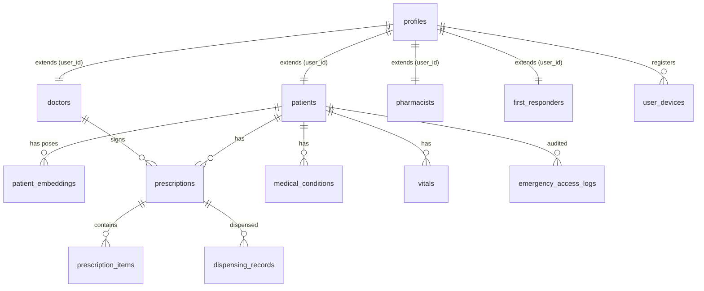

# Database Schema & Indexing Guide 💾

This document provides the official database schema specification, indexes, triggers, and Row-Level Security (RLS) policies implemented on the CareSync platform.

---

## 1. Entity Relationship (ER) Diagram

The PostgreSQL database leverages role-specific profiles, immutable logs, and vector embeddings for facial identification search routing:



---

## 2. Table Registry & Schemas

### A. Profiles & Role Extension Tables

#### `profiles`
* **Purpose**: Extends default Supabase `auth.users` schema.
* **Columns**:
  - `id` (UUID, Primary Key): Foreign key to `auth.users(id)`.
  - `email` (TEXT, NOT NULL).
  - `full_name` (TEXT, NOT NULL).
  - `role` (TEXT, NOT NULL): Allowed values: `patient`, `doctor`, `pharmacist`, `first_responder`.

#### `patients`
* **Purpose**: Patient clinical metadata, QR code bindings, and centroid vector representation caches.
* **Columns**:
  - `id` (UUID, Primary Key).
  - `user_id` (UUID, Unique Reference to `profiles(id)`).
  - `blood_type` (TEXT, Nullable): e.g. `O+`, `AB-`.
  - `date_of_birth` (DATE, Nullable).
  - `emergency_contact` (JSONB, Nullable).
  - `qr_code_id` (TEXT, Unique): Scanned by first responders.
  - `face_centroid_embedding` (vector(512), Nullable): Centroid vector calculation of all enrolled poses.

---

### B. Biometric Poses & Vector Tables

#### `patient_embeddings`
* **Purpose**: Stores vector embeddings extracted from multi-pose face enrollments.
* **Columns**:
  - `id` (UUID, Primary Key).
  - `patient_id` (UUID, Foreign Key referencing `patients(id)` ON DELETE CASCADE).
  - `embedding` (vector(512), NOT NULL).
  - `pose_label` (TEXT, NOT NULL): e.g., `neutral`, `smile`, `left_30`, `right_30`.
  - `quality_score` (DOUBLE PRECISION, Defaults to 1.0).
  - `yaw` (DOUBLE PRECISION, Nullable).
  - `pitch` (DOUBLE PRECISION, Nullable).
  - `roll` (DOUBLE PRECISION, Nullable).
  - `created_at` (TIMESTAMP WITH TIME ZONE).

---

### C. Clinical Core Tables

#### `prescriptions`
* **Purpose**: Electronic medical prescriptions containing prescription metadata.
* **Columns**:
  - `id` (UUID, Primary Key).
  - `patient_id` (UUID, REFERENCES `patients(id)`).
  - `doctor_id` (UUID, REFERENCES `profiles(id)`).
  - `status` (TEXT): e.g., `active`, `completed`, `cancelled`.
  - `doctor_signature` (TEXT, Base64 representation).
  - `signature_hash` (TEXT, SHA-256).

#### `medical_conditions`
* **Purpose**: Chronic conditions, active medications, and severe allergies.
* **Columns**:
  - `id` (UUID, Primary Key).
  - `patient_id` (UUID, REFERENCES `patients(id)`).
  - `condition_type` (TEXT): `allergy`, `chronic`, `medication`, `other`.
  - `severity` (TEXT): `mild`, `moderate`, `severe`, `critical`.
  - `is_public` (BOOLEAN): If true, visible to first responders.

#### `vitals`
* **Purpose**: Decrypted demographic vitals tracking history (BP, SpO2, Heart Rate).

---

## 3. Index Registry & Optimization (Sprint 1 Landmark)

CareSync uses HNSW vector indexes for biometrics and B-Tree indexes for paginated lookups:

| Index Name | Table | Columns | Index Type | Target Benefit |
| :--- | :--- | :--- | :--- | :--- |
| `idx_patients_face_centroid_embedding` | `patients` | `face_centroid_embedding` | HNSW (`vector_cosine_ops`) | Sub-50ms centroid matching. |
| `idx_patient_embeddings_vector` | `patient_embeddings` | `embedding` | HNSW (`vector_cosine_ops`) | Multi-pose similarity matching search. |
| `idx_audit_log_user_timestamp` | `audit_log` | `user_id`, `timestamp DESC` | B-Tree | Fast retrieval of user audit history. |
| `idx_prescriptions_patient_id` | `prescriptions` | `patient_id`, `created_at DESC` | B-Tree | High-speed paginated prescription timeline. |
| `idx_appointments_patient_time` | `appointments` | `patient_id`, `start_time DESC` | B-Tree | Paginated appointment histories for patients. |
| `idx_appointments_doctor_time` | `appointments` | `doctor_id`, `start_time DESC` | B-Tree | Paginated clinical schedule lookup for doctors. |

---

## 4. Trigger & RPC Logic

### Centroid Cache Recalculation
A database trigger updates the cache in `patients.face_centroid_embedding` when a new biometric pose is added:
```sql
CREATE OR REPLACE FUNCTION update_patient_face_centroid()
RETURNS TRIGGER AS $$
DECLARE
    avg_vector vector(512);
    target_patient_id UUID;
BEGIN
    target_patient_id := COALESCE(NEW.patient_id, OLD.patient_id);

    SELECT avg(embedding) INTO avg_vector
    FROM patient_embeddings
    WHERE patient_id = target_patient_id;

    UPDATE patients
    SET face_centroid_embedding = avg_vector, updated_at = now()
    WHERE id = target_patient_id;

    RETURN NEW;
END;
$$ LANGUAGE plpgsql;
```

### Smart Multi-Embedding Matching RPC
Invoked by FastAPI service:
```sql
CREATE OR REPLACE FUNCTION match_patient_by_face_multi(
    query_embedding vector(512),
    max_distance double precision,
    match_limit integer DEFAULT 10
)
RETURNS TABLE (
    patient_id UUID,
    qr_code_id TEXT,
    full_name TEXT,
    pose_label TEXT,
    similarity double precision,
    quality_score double precision
) AS $$
...
$$ LANGUAGE plpgsql;
```
