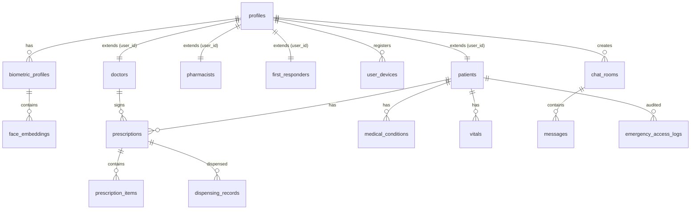

# Database Schema & pgvector Audit 💾

This document describes the database design, tables, constraints, indexes, triggers, and Row-Level Security (RLS) policies of the CareSync platform.

---

## 1. Entity Relationship (ER) Diagram

CareSync uses a relational PostgreSQL database with role-based access models, auditing tables, messaging channels, and biometric vector embeddings:



---

## 2. Table Audits & Schemas

### A. Profiles & Role Extensions

#### `profiles`
* **Purpose**: Extends Supabase auth metadata to map core roles and profile attributes.
* **Columns**:
  - `id` (UUID, Primary Key): Maps directly to `auth.users(id)`.
  - `email` (TEXT, NOT NULL).
  - `full_name` (TEXT, NOT NULL).
  - `role` (TEXT, NOT NULL): Allowed values: `patient`, `doctor`, `pharmacist`, `first_responder`.
  - `avatar_url` (TEXT, Nullable).
* **Policies**:
  - Select: Allowed for authenticated users.
  - Update: Only allowed if `auth.uid() = id`.

#### `patients`
* **Purpose**: Patient-specific metadata (blood type, birth date, emergency contact card).
* **Columns**:
  - `id` (UUID, Primary Key).
  - `user_id` (UUID, Unique Reference to `profiles(id)`).
  - `blood_type` (TEXT): Allowed values: `A+`, `A-`, `B+`, `B-`, `AB+`, `AB-`, `O+`, `O-`.
  - `date_of_birth` (DATE).
  - `emergency_contact` (JSONB): Structured as `{ "name": "...", "phone": "...", "relationship": "..." }`.
  - `qr_code_id` (TEXT, Unique): Used in emergency lookup urls.

#### `doctors` / `pharmacists` / `first_responders`
* **Purpose**: Role-specific credentials (license numbers, specialization details, badge numbers).
* **Triggers**: Trigger functions validate that the related profile role matches the specific table's role upon row insertion.

---

### B. Biometric vector Tables

#### `biometric_profiles`
* **Purpose**: Manages biometric registration state for patient face recognition.
* **Columns**:
  - `id` (UUID, Primary Key).
  - `user_id` (UUID, Unique Reference to `profiles(id)`).
  - `enrollment_status` (TEXT): Allowed values: `unverified`, `verified`, `suspended`.

#### `face_embeddings`
* **Purpose**: Stores ArcFace face signature coordinates using `pgvector`.
* **Columns**:
  - `id` (UUID, Primary Key).
  - `biometric_profile_id` (UUID, Reference to `biometric_profiles(id)`).
  - `embedding` (vector(512)): Stores the 512-dimension normalized floats.
  - `pose_label` (TEXT): Allowed values: `neutral`, `smile`, `angle_left`, `angle_right`.
  - `is_active` (BOOLEAN): Defaults to `true`.
* **Index**:
  - HNSW index using cosine operations for sub-50ms vector lookups:
    ```sql
    CREATE INDEX idx_face_embeddings_vector 
    ON public.face_embeddings USING hnsw (embedding vector_cosine_ops);
    ```

---

### C. Medical Core Tables

#### `prescriptions` & `prescription_items`
* **Purpose**: Contains prescription data issued by doctors (or scanned by patients).
* **Columns**:
  - `patient_id` (UUID, Reference to `patients(id)`).
  - `doctor_id` (UUID, Reference to `profiles(id)`).
  - `is_public` (BOOLEAN): If true, details can be accessed by first responders during emergencies.
  - `status` (TEXT): Allowed values: `active`, `completed`, `cancelled`.
  - `doctor_signature` (TEXT, Nullable): Base64 signature image.
  - `signature_hash` (TEXT, Nullable): SHA-256 validation stamp.

#### `medical_conditions`
* **Purpose**: Chronic conditions, allergies, and alerts. Used by first responders.
* **Columns**:
  - `condition_type` (TEXT): Allowed values: `allergy`, `chronic`, `medication`, `other`.
  - `severity` (TEXT): Allowed values: `mild`, `moderate`, `severe`, `critical`.

#### `vitals`
* **Purpose**: Demographic vitals chart data (blood pressure, oxygen levels, heart rate).

---

### D. Audit Logging

#### `biometric_access_logs` (Immutable Audit Trail)
* **Purpose**: Tracks every API request accessing a patient's medical file during a search.
* **Immutability Enforcement**: An database trigger prevents update or delete actions on this table:
  ```sql
  CREATE OR REPLACE FUNCTION public.prevent_audit_changes()
  RETURNS TRIGGER AS $$
  BEGIN
      RAISE EXCEPTION 'Audit logs are immutable. Modifying records is prohibited.';
  END;
  $$ LANGUAGE plpgsql;

  CREATE TRIGGER trigger_prevent_audit_changes
  BEFORE UPDATE OR DELETE ON public.biometric_access_logs
  FOR EACH ROW EXECUTE FUNCTION public.prevent_audit_changes();
  ```

---

## 3. Remote Procedure Calls (RPCs) & Functions

### `match_patient_by_face_consensus`
* **Description**: Custom function called by the FastAPI `/identify` pipeline to fetch candidates matching the face vector.
* **Parameters**:
  - `query_embedding` (vector(512))
  - `max_distance` (DOUBLE PRECISION)
  - `match_limit` (INTEGER)
* **Query Logic**:
  ```sql
  SELECT 
    bp.user_id AS patient_id,
    p.full_name,
    p.qr_code_id,
    (1 - (fe.embedding <=> query_embedding))::DOUBLE PRECISION AS similarity
  FROM public.face_embeddings fe
  JOIN public.biometric_profiles bp ON fe.biometric_profile_id = bp.id
  JOIN public.profiles p ON bp.user_id = p.id
  WHERE fe.is_active = true
    AND (fe.embedding <=> query_embedding) < max_distance
  ORDER BY fe.embedding <=> query_embedding ASC
  LIMIT match_limit;
  ```

### `submit_kyc_verification_secure`
* **Description**: Secure transaction function that updates patient records and logs KYC verification submissions.
