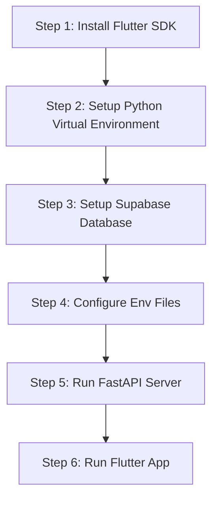

# Developer Onboarding & Local Setup 🛠️

This document helps new developers set up, run, and debug the CareSync codebase locally.

---

## 1. Quickstart Checklist

To run the entire ecosystem on your local machine, complete the following setup steps:



---

## 2. Step 1: Flutter Client Environment

### Prerequisites
* **Flutter SDK**: Install Flutter (version `3.7+` is required).
* **Xcode** (macOS only, for iOS builds) or **Android Studio** (for Android simulator execution).

### Commands
1. Retrieve dependencies:
   ```bash
   flutter pub get
   ```
2. Run analyzer checks to verify code health:
   ```bash
   flutter analyze
   ```
3. Run code generators (if any are active):
   ```bash
   flutter pub run build_runner build --delete-conflicting-outputs
   ```

---

## 3. Step 2: Biometrics API Setup (Python)

The API service runs locally and downloads neural networks for facial recognition.

### Commands
1. Navigate to the api directory:
   ```bash
   cd biometric_api
   ```
2. Create and activate a Python virtual environment:
   ```bash
   python3 -m venv venv
   source venv/bin/activate
   ```
3. Install required packages:
   ```bash
   pip install --upgrade pip
   pip install -r requirements.txt
   ```
4. Download the ArcFace and RetinaFace weights before starting the server:
   ```bash
   python download_models.py
   ```
   *Note: This downloads files directly to the `.deepface/weights` directory.*

---

## 4. Step 3: Database & Mock Data Seeding

Set up the database schema and add test profiles:

1. Create a free project on [supabase.com](https://supabase.com).
2. Go to **SQL Editor** in the Supabase console.
3. Apply migration scripts located in `supabase/` sequentially.
4. Execute `supabase/014_seed_test_doctors.sql` to add mock profiles:
   - This seeds test accounts with predefined roles.
   - Example login credentials for testing:
     - **Patient**: `patient@caresync.com` / `Password123!`
     - **Doctor**: `doctor@caresync.com` / `Password123!`
     - **Pharmacist**: `pharmacist@caresync.com` / `Password123!`
     - **First Responder**: `responder@caresync.com` / `Password123!`

---

## 5. Step 4: Run the Application Stack

### Start the Python API Server
From the `biometric_api` directory:
```bash
uvicorn main:app --reload --host 127.0.0.1 --port 8000
```
Verify the server status by navigating to `http://127.0.0.1:8000/` in your browser.

### Start the Flutter Application
From the repository root:
1. Ensure your simulator is running.
2. Run the application:
   ```bash
   flutter run
   ```

### Debugging & Hot Reload
- Press **`r`** in the terminal running Flutter to perform a hot reload.
- Press **`R`** to perform a hot restart (resets app state).
- To debug environment configurations, check that the IP address in your `.env` matches your computer's local IP address (especially when running on a physical Android device, use your system's network IP instead of `localhost`).
