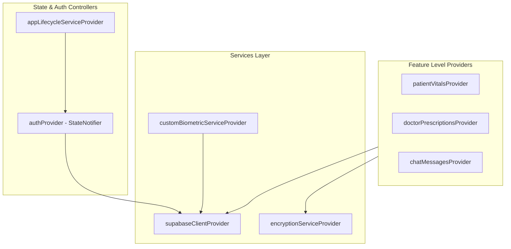

# Flutter Client Architecture & Layouts 📱

This document describes the clean-architecture patterns, code structure, navigation routing, Riverpod state management, and brand UI styling implemented in the CareSync Flutter client application.

---

## 1. Feature-Driven Clean Architecture

CareSync uses a **Feature-Driven Architecture**. Code is organized by domain features rather than functional layers, which increases maintainability and scalability:

```text
lib/
├── main.dart                       # Entry point, dotenv initialization, app initialization
├── app.dart                        # MaterialApp widget, styling themes, AppLifecycleService observer
├── core/                           # Shareable resources across all features
│   ├── config/                     # Environment values mapping (env_config.dart)
│   ├── theme/                      # Brand design tokens (app_theme.dart, colors, dimensions)
│   └── widgets/                    # Global reusable widgets (BiometricGuard, loading skeletons)
├── routing/                        # Navigation configuration
│   ├── app_router.dart             # GoRouter setup, nested layouts, route guards (role-based)
│   └── route_names.dart            # Centralized string route paths and names
├── services/                       # Cross-cutting stateful service controllers
│   ├── app_lifecycle_service.dart  # Inactivity monitoring (15-min auto-lock)
│   ├── auth_controller.dart        # Authentication actions wrapper
│   ├── supabase_service.dart       # Core data calls wrapper (SELECT/INSERT/RPCs)
│   ├── custom_biometric_service.dart # FastAPI interaction wrapper (analyze_frame, enroll, identify)
│   ├── encryption_service.dart     # AES-256 GCM symmetric crypt utilities
│   ├── secure_storage_service.dart # Encrypted local key storage
│   └── pdf_service.dart            # Digital prescription PDF rendering
└── features/                       # Segmented domain modules
    ├── auth/                       # Signin, signup, role selection, KYC, 2FA validation
    ├── patient/                    # Patient portal (vitals tracking, dashboard, QR, settings)
    ├── doctor/                     # Doctor portal (patient records, prescription submission)
    ├── pharmacist/                 # Pharmacist portal (prescription list, dispensation checks)
    ├── emergency/                  # Responder portal (scan face, view patient vitals cards)
    └── shared/                     # Chat rooms, messaging threads, profiles, notifications
```

Each feature folder is organized into clean layers:
* `models/`: Plain Dart data representations and JSON serialization logic.
* `providers/`: Riverpod states, controllers, and dependency injections.
* `presentation/`: Widget components and layout screens.

---

## 2. State Management & Riverpod Caching (Sprint 1 & 2 Landmark)

CareSync uses **Riverpod** for reactive state propagation and dependency injection:



### Riverpod Best Practices & Caching
1. **Riverpod Caching**: Data providers leverage `ref.keepAlive()` or `.autoDispose` caching strategies. This retains active queries in memory while navigated screens remain mounted, bypassing repeat database transactions and ensuring sub-20ms screen transitions.
2. **Connectivity Observer (Sprint 1)**: An active network connectivity stream observer watches connection health. When offline, it blocks network-dependent calls, informs the user with subtle top-bar alerts, and fetches data directly from secure local cache variables.
3. **No `ref.read` in build()**: Use `ref.watch` in build or inside other providers to maintain reactive rebuild bindings.

---

## 3. Navigation & GoRouter Guards

CareSync uses **GoRouter** to enable deep linking and nested shell navigation. The routing engine ensures that users can only visit screens matching their database roles.


### Navigation Structure
* **Authentication Routes**: `/login`, `/register`, `/role-selection`, `/kyc-verification`.
* **Sub-shells (Nested Shells)**: Uses `StatefulShellRoute.indexedStack` to maintain the navigation stacks when switching tabs inside dashboards.
* **Role Dashboards**:
  - Patient: `/patient/dashboard`, `/patient/vitals`, `/patient/qr`, `/patient/settings`.
  - Doctor: `/doctor/dashboard`, `/doctor/patient-lookup`, `/doctor/prescribe`.
  - Pharmacist: `/pharmacist/dashboard`, `/pharmacist/dispense`.
  - First Responder: `/emergency/dashboard`, `/emergency/scan`.

---

## 4. UI Design System & Modular Widgets (Sprint 2 Landmark)

All UI interfaces implement a unified design language:

### Styling & Brand Color Tokens (`lib/core/theme/`)
* **Primary (Accent)**: Orange (`Color(0xFFF95B00)`) representing high-visibility medical response, or Teal (`Color(0xFF0D9488)`) for clinical components.
* **Dark Background**: Midnight Slate (`Color(0xFF0F172A)`) and Card Gray (`Color(0xFF1E293B)`) to provide a premium feel.
* **Alert colors**:
  - Danger (DDI clashing, validation failure): Ruby Red (`Color(0xFFE11D48)`).
  - Warnings: Amber Orange (`Color(0xFFD97706)`).
  - Success: Emerald Green (`Color(0xFF059669)`).

### Reusable Shared Widgets
To maintain consistency and reduce code churn:
* **`SquircleCard`**: Custom card using the squircle standard with thin borders and subtle shadow offsets.
* **`CSButton`**: Standard buttons (Primary, Secondary, Destructive, Outlined) with circular border radius configs matching the Design DNA.
* **`BiometricGuard`**: Encapsulates screens with an overlay prompt that intercepts rendering if the user has been inactive for more than 15 minutes, unlocking only on local biometric verification.

---

## 5. Offline Support & Local Data Caching

* **Symmetric QR Payloads**: When a patient generates an emergency QR code, vital data is compiled, encrypted using a symmetric key, and directly embedded into the QR graphic. Responders scan the code and decrypt the data entirely offline without making database requests.
* **Session Persistence**: Authentication tokens, active user profile details, and device trust states are written to `flutter_secure_storage` to allow immediate app startup without network checks.
