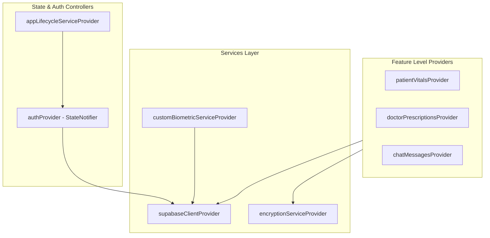
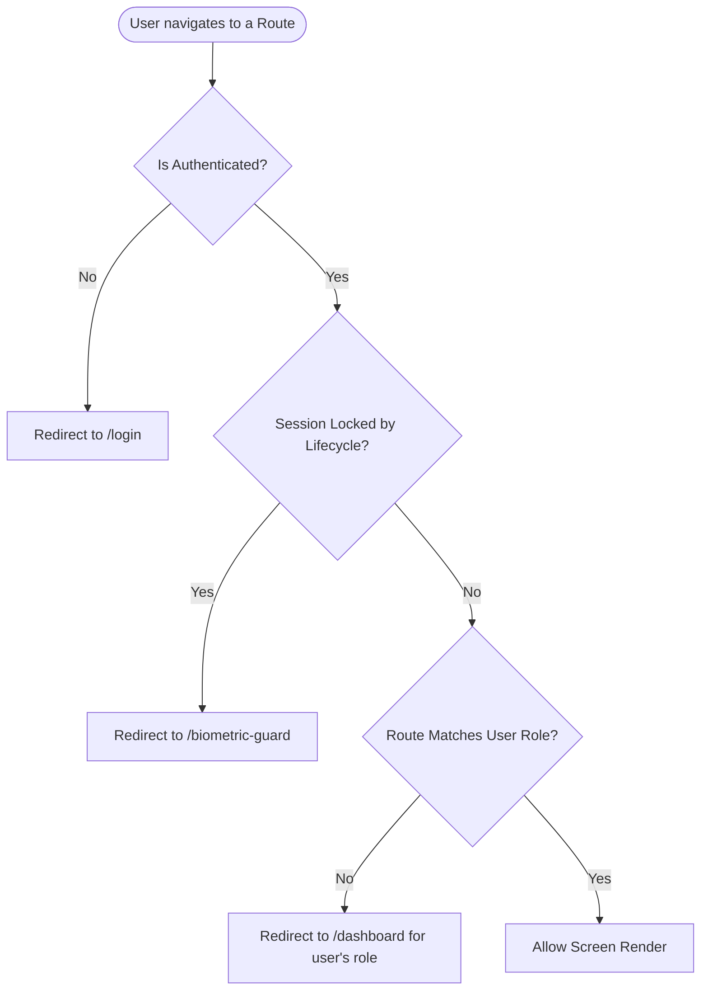

# Flutter Client Architecture & Layouts 📱

This document describes the design patterns, code structure, navigation, state management, and widgets of the CareSync Flutter client application.

---

## 1. Feature-Driven Folder Structure

CareSync uses a **Feature-Driven Architecture**. Code is organized by domain features rather than functional layers, which increases maintainability and scalability:

```text
lib/
├── main.dart                       # Entry point, dotenv initialization, app initialization
├── app.dart                        # MaterialApp widget, styling themes, AppLifecycleService observer
├── core/                           # Shareable resources across all features
│   ├── config/                     # Environment values mapping (env_config.dart)
│   ├── theme/                      # Brand design tokens (app_theme.dart, colors, dimensions)
│   └── widgets/                    # Global reusable widgets (BiometricGuard, loading skeletons)
├── routing/                        # Navigation configuration
│   ├── app_router.dart             # GoRouter setup, nested layouts, route guards (role-based)
│   └── route_names.dart            # Centralized string route paths and names
├── services/                       # Cross-cutting stateful service controllers
│   ├── app_lifecycle_service.dart  # Inactivity monitoring (15-min auto-lock)
│   ├── auth_controller.dart        # Authentication actions wrapper
│   ├── supabase_service.dart       # Core data calls wrapper (SELECT/INSERT/RPCs)
│   ├── custom_biometric_service.dart # FastAPI interaction wrapper (analyze_frame, enroll, identify)
│   ├── encryption_service.dart     # AES-256 GCM symmetric crypt utilities
│   ├── secure_storage_service.dart # Encrypted local key storage
│   └── pdf_service.dart            # Digital prescription PDF rendering
└── features/                       # Segmented domain modules
    ├── auth/                       # Signin, signup, role selection, KYC, 2FA validation
    ├── patient/                    # Patient portal (vitals tracking, dashboard, QR, settings)
    ├── doctor/                     # Doctor portal (patient records, prescription submission)
    ├── pharmacist/                 # Pharmacist portal (prescription list, dispensation checks)
    ├── emergency/                  # Responder portal (scan face, view patient vitals cards)
    └── shared/                     # Chat rooms, messaging threads, profiles, notifications
```

Inside each feature directory, code is split into three clean layers:
* `models/`: Plain Dart data representations and JSON serialization logic.
* `providers/`: Riverpod states, controllers, and dependency injections.
* `presentation/`: Widget components and layout screens.

---

## 2. State Management & Dependency Injection (Riverpod)

CareSync relies on **Flutter Riverpod** for state propagation and dependency injection. State mutation is handled using `StateNotifier` and asynchronous requests are wrapped inside `AsyncValue` to keep UI rendering reactive and loading states clean.

### Core Providers Diagram



### Riverpod Usage Guidelines
1. **Never read providers inside initialization methods (like `initState`)**: Use `ref.read` in callbacks or `ref.watch` in `build` to rebuild widgets reactively.
2. **Provider Cleanups**: Use `.autoDispose` on short-lived states (like diagnostic scans or chat messages) to prevent memory leaks.
3. **Dependency Injection**: Wrap third-party services in providers (like `secureStorageProvider`) to keep business logic easily testable.

---

## 3. Navigation & Role-Based Route Guards (GoRouter)

CareSync uses **GoRouter** to enable deep linking and nested shell navigation. The routing engine ensures that users can only visit screens matching their database roles.

### Route Guard Validation Flow



### Navigation Structure
* **Authentication Routes**: `/login`, `/register`, `/role-selection`, `/kyc-verification`.
* **Sub-shells (Nested Shells)**: Uses `StatefulShellRoute.indexedStack` to maintain the navigation stacks when switching tabs inside dashboards.
* **Role Dashboards**:
  - Patient: `/patient/dashboard`, `/patient/vitals`, `/patient/qr`, `/patient/settings`.
  - Doctor: `/doctor/dashboard`, `/doctor/patient-lookup`, `/doctor/prescribe`.
  - Pharmacist: `/pharmacist/dashboard`, `/pharmacist/dispense`.
  - First Responder: `/emergency/dashboard`, `/emergency/scan`.

---

## 4. UI Design System & Brand Styling

CareSync has a customized design layout, leveraging dark themes, glassmorphism containers, and interactive micro-animations.

### Brand Color Tokens (`lib/core/theme/`)
* **Primary (Accent)**: Teal (`Color(0xFF0D9488)`) representing safety, hygiene, and medical responsiveness.
* **Dark Background**: Midnight Navy (`Color(0xFF0F172A)`) and Slate Gray (`Color(0xFF1E293B)`) to provide a premium feel.
* **Alert colors**:
  - Danger (DDI clashing, validation failure): Ruby Red (`Color(0xFFE11D48)`).
  - Warnings: Amber Orange (`Color(0xFFD97706)`).
  - Success: Emerald Green (`Color(0xFF059669)`).

### Premium Reusable Widgets
1. **`BiometricGuard`**: Encapsulates screens with an overlay prompt that intercepts rendering if the user has been inactive for more than 15 minutes, unlocking only on local biometric verification.
2. **`AdaptiveCardContainer`**: Implements a glassmorphic look with thin white borders and blur filters (`BackdropFilter`) to display demographic details elegantly.
3. **`LoadingSkeleton`**: Provides animated gradient placeholders for charts and prescription lists.

---

## 5. Offline Support & Local Data Caching

To guarantee reliability in medical dead zones, CareSync implements **offline-first parsing and caching**:
1. **Symmetric QR Payloads**: When a patient generates an emergency QR code, vital data is compiled, encrypted using a symmetric key, and directly embedded into the QR graphic. Responders scan the code and decrypt the data entirely offline without making database requests.
2. **Session Persistence**: Authentication tokens, active user profile details, and device trust states are written to `flutter_secure_storage` to allow immediate app startup without network checks.
3. **Offline Chat Buffer**: Outgoing chat messages written while offline are logged in a local sqlite database and automatically synchronized using Supabase Realtime when the network is restored.
