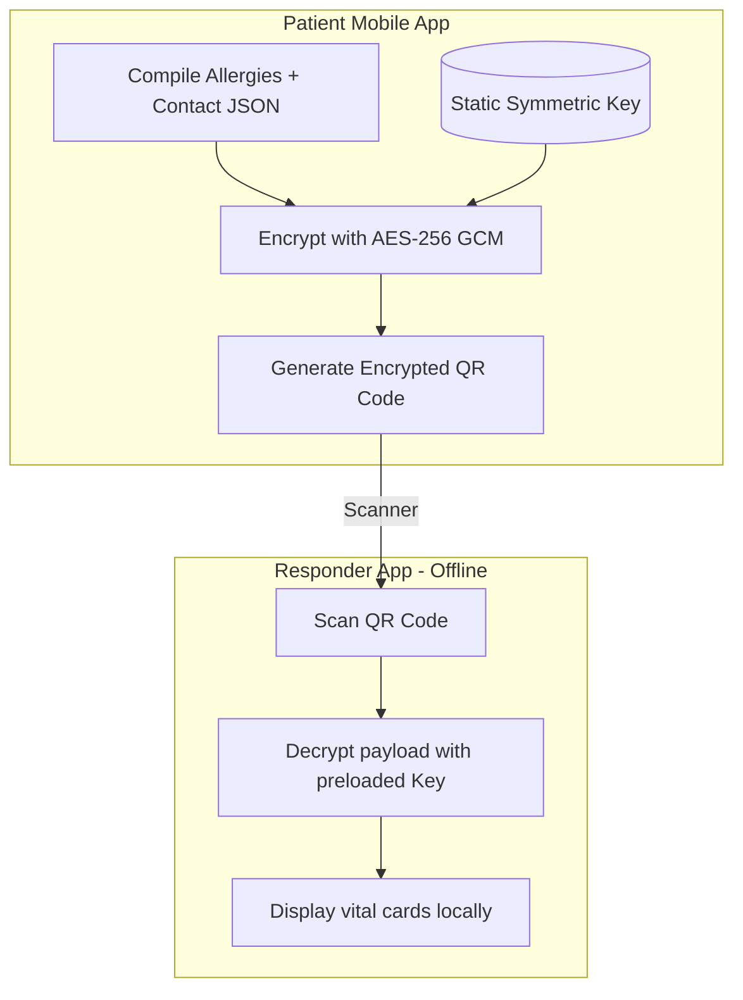

# Security Architecture & Compliance Guidelines 🛡️

This document describes the security protocols, encryption methodologies, Row-Level Security (RLS) policies, and data controls of the CareSync platform.

CareSync is designed with HIPAA-aligned security principles and implements security controls commonly associated with HIPAA requirements to protect Protected Health Information (PHI) and secure biometric attributes.

---

## 1. Data Classification & PHI Separation

CareSync segregates data into three tiers of access and sensitivity:

| Tier | Data Classification | Security controls |
| :--- | :--- | :--- |
| **Tier 1: Emergency demographic Data** | Basic demographic info, blood type, severe allergies, primary emergency contacts. | Encrypted via AES-256-GCM for offline emergency QR display; readable by verified responders. |
| **Tier 2: Private Clinical Data** | Prescriptions, active medical histories, lab reports, doctor chats, and vital history trends. | Strictly restricted to owner and explicitly authorized medical professionals; RLS enforced. |
| **Tier 3: Sensitive Biometric Data** | Facial images, facial crop templates, and 512-dimension biometric vector embeddings. | Vectors are normalized and irreversible (cannot recreate face); stored anonymously. |

---

## 2. Row-Level Security (RLS) Policy Mapping

Every table in the CareSync database has RLS active. Below is the mapping of access criteria:

| Table | Operations | Allowed Access Criteria |
| :--- | :--- | :--- |
| **`profiles`** | `SELECT`, `UPDATE` | Users can view all active profiles (for search lookup); edits restricted to `auth.uid() = id`. |
| **`patients`** | `SELECT` | Owned profile (`auth.uid() = user_id`) OR First Responders with an active emergency window. |
| **`prescriptions`** | `SELECT` | Owner patient OR the issuing doctor profile (`doctor_id` of prescription). |
| | `INSERT`, `UPDATE` | Restricted to authenticated users with the `doctor` role. |
| **`medical_conditions`** | `SELECT` | Owner patient OR public emergency conditions (if marked `is_public`). |
| **`biometric_access_logs`** | `SELECT`, `INSERT` | Access logs can only be read by the patient or target doctor; inserts via DB triggers. |

> [!WARNING]
> Database triggers raise SQL exceptions blocking any updates (`UPDATE`) or deletions (`DELETE`) on `biometric_access_logs`, creating a tamper-proof audit trail for HIPAA compliance checks.

---

## 3. Storage Security & Signed URLs (Sprint 1 Landmark)

To prevent exposure of private health documents and facial images:
* **Private Storage Buckets**: All uploads (selfie scans, prescriptions, reports) are stored in non-public Supabase storage buckets.
* **Signed URL Delivery**: The client request invokes a secure Edge RPC that generates an expires-bounded signed URL (expiry: 60 seconds). Once the time window closes, the URL is invalidated at the CDN level.

---

## 4. Cryptographic QR Codes (Offline-First Emergency Bypass)

In remote areas without mobile data access, first responders can access critical demographic and allergy records using offline symmetric decryption:

### Encryption Parameters
* **Algorithm**: AES-256-GCM.
* **Key Distribution**: A static key is pre-shared and embedded within the client application binary compilation to support offline decrypt capabilities.
* **Scope**: Limits offline data payload strictly to Tier 1 emergency details.

---

## 5. Session Locks & Biometric Guard

* **15-Minute Auto-Lock**: An app-level lifecycle listener records device touch signals. If the app remains in the background or inactive for more than 15 minutes, it forces the user to the `biometric-guard` route, requiring Face ID or local PIN input to restore session state.
* **Device Authentication**: Secure storage stores cryptographic session keys inside iOS Keychain / Android KeyStore, protected by device biometric enrollment checks.
