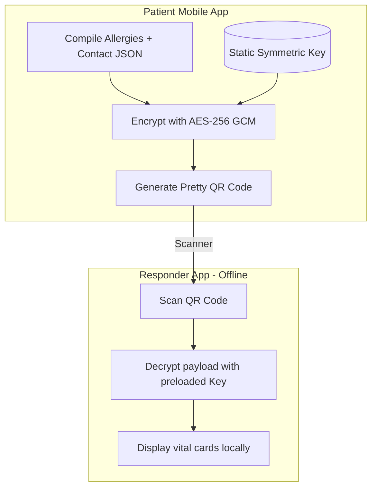

# Security Architecture & HIPAA Compliance 🛡️

This document describes the security protocols, encryption methods, Row-Level Security (RLS) configurations, and compliance controls that secure CareSync.

---

## 1. HIPAA Compliance & Data Classification

CareSync manages Protected Health Information (PHI) and must comply with HIPAA regulations (Health Insurance Portability and Accountability Act).

### PHI Data Classification
* **Public Emergency Data**: Demographics, blood type, severe allergies, and emergency contact card. This data is exposed to first responders via the emergency QR code.
* **Private Clinical Data**: Prescriptions, detailed diagnoses, lab reports, doctor chat histories, and vitals history logs. This data is private and locked behind authentication or explicit consent records.
* **Sensitive Biometric Data**: Image face frames and 512-dimension vector coordinates. These coordinates cannot be reverse engineered to recreate the user's face. They are stored without names inside the database, referenced only by UUID keys.

---

## 2. Row-Level Security (RLS) Policy Audit

Every table in the database is protected by Row-Level Security policies. Users can only access rows matching their authenticated identities.

### Table Policies Mapping

| Table | Policy Name | Access Criteria |
| :--- | :--- | :--- |
| **`profiles`** | "Profiles view self" | `auth.uid() = id` |
| | "System select profiles" | `authenticated` users can read names (for searches) |
| **`patients`** | "Patients read write self" | `auth.uid() = user_id` |
| | "Responder select emergency" | `first_responder` can read if active emergency log exists |
| **`prescriptions`** | "Doctor insert update" | Only if `profiles.role = 'doctor'` and is active |
| | "Patient read self" | Only if `prescriptions.patient_id = patients.id` where `patients.user_id = auth.uid()` |
| **`medical_conditions`** | "Responder select public" | Allow reading if `is_public = true` during scan |
| **`biometric_access_logs`** | "Logs insert system" | Automatically written by database triggers |
| | "Logs select owner" | Only viewable by the actor or the target patient |

---

## 3. Device Security & Session Management

### 15-Minute Auto-Lock
To prevent unauthorized access on unattended devices, CareSync enforces an activity timer:
1. `AppLifecycleService` records the timestamp of user actions.
2. If the application goes to the background or has no touch interactions for more than **15 minutes**, a state variable `isSessionLocked` is set to `true`.
3. GoRouter detects the locked state and redirects the user to `/biometric-guard`.
4. The user must complete local Face ID or passcode authentication (via `local_auth`) to unlock the view.

### Trusted Device Registration (2FA)
When logging in from a new device, a two-factor challenge (2FA) is triggered:
* An OTP is sent to the registered email/phone.
* Upon validation, the device ID is stored in `user_devices`.
* Future logins from this device bypass the 2FA step, checking the device fingerprint hash.

---

## 4. Cryptographic QR Codes (Offline-First)

For situations without internet access (e.g. subways, wilderness), CareSync uses an offline-first QR decryption mechanism.

### Encryption Protocol
* **Algorithm**: AES-256-GCM.
* **Payload**: Includes name, DOB, blood type, active emergency conditions, and emergency contacts.
* **Key Distribution**: A static key is built into the client application binary, enabling decryption by the responder's app without internet connections.

---

## 5. Immutable Audit Trails

All emergency operations and biometric searches write logs to the database:
* Trigger functions (`BEFORE UPDATE OR DELETE`) raise database exceptions, preventing any modifications to `biometric_access_logs` or `emergency_access_logs`.
* Audit records remain tamper-proof, satisfying HIPAA audit requirements.
* These logs can be reviewed by patients in their privacy settings screen.
