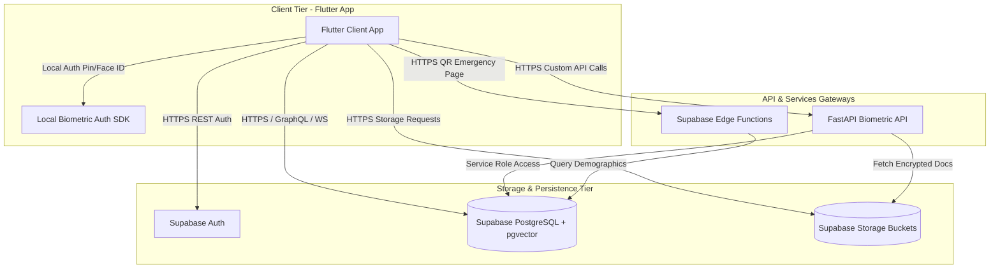
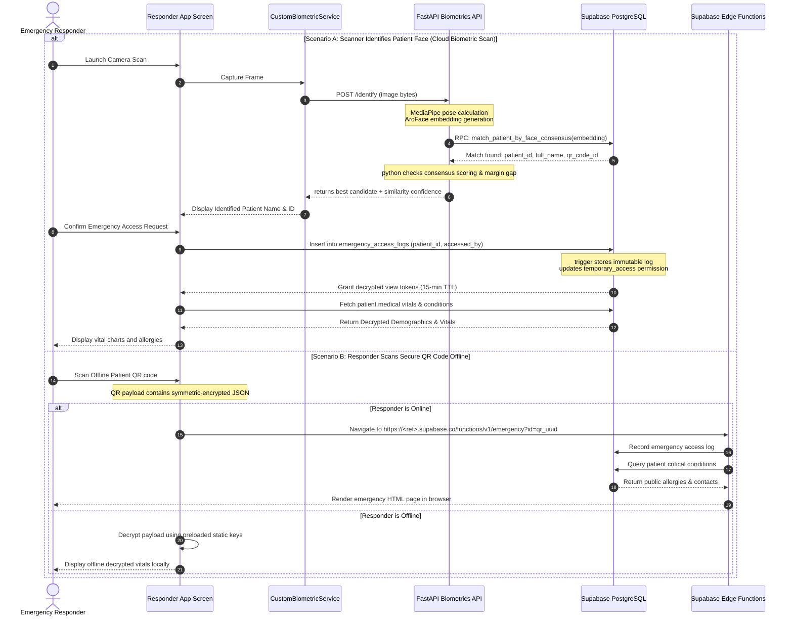
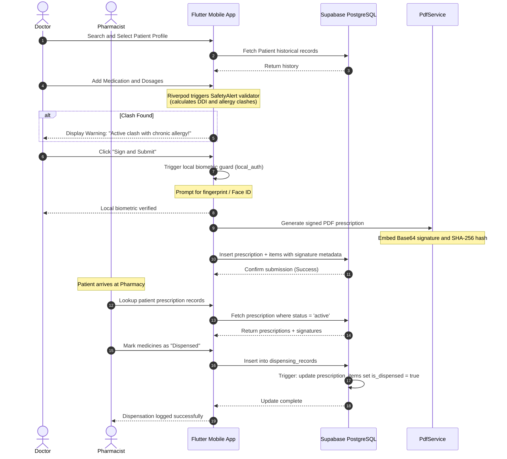
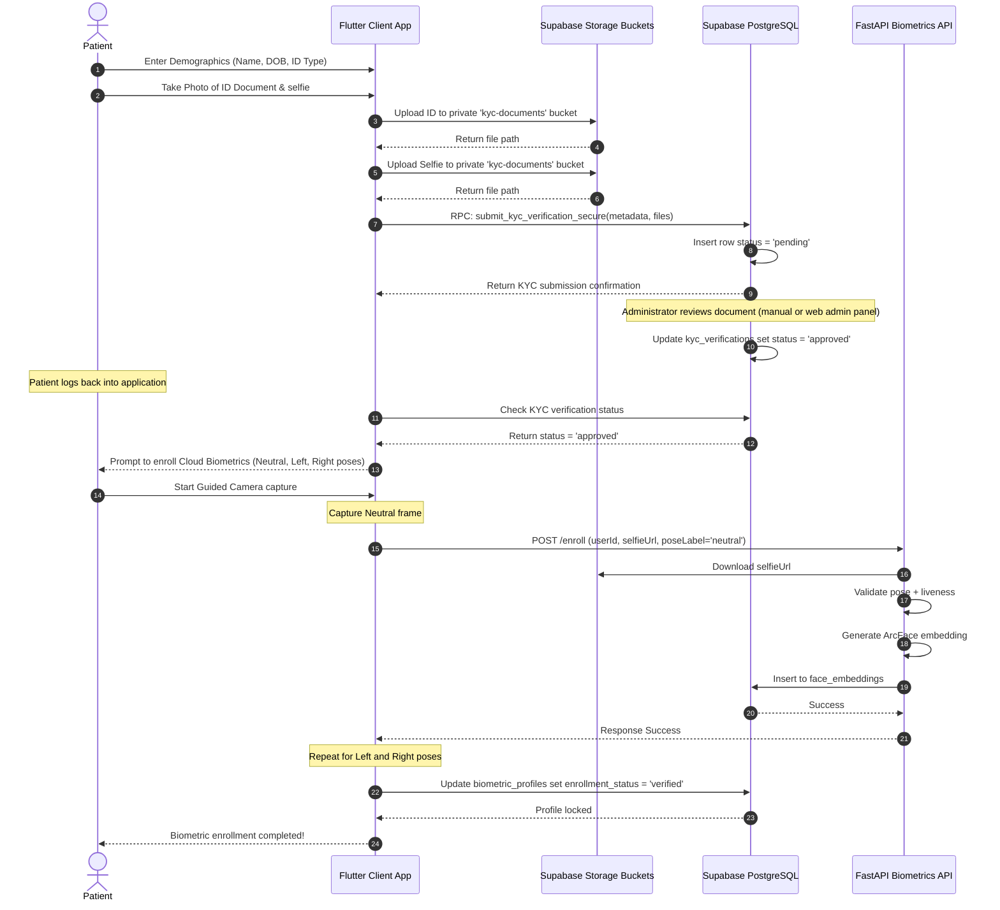

# System Architecture & Subsystem Workflows 🏗️

This document describes the high-level architecture of the CareSync ecosystem and details the cross-subsystem workflows.

---

## 1. High-Level Ecosystem Architecture

CareSync is designed around a three-tier architecture that bridges client applications with secure authentication, database access controls, and custom ML-powered biometric recognition:

### Components Summary

1. **Flutter Mobile Client**: Operates as a single cross-platform application configured with role-based UI screens for Patients, Doctors, Pharmacists, and First Responders. Incorporates local storage encryption using `flutter_secure_storage` and local biometric guards using the `local_auth` SDK.
2. **FastAPI Biometrics API**: A self-hosted Python microservice that handles computational tasks: face extraction via RetinaFace, landmark mapping via MediaPipe Face Mesh, quality score gates, and 512-dimension vector embedding generation via ArcFace. It directly queries Supabase for vector comparison and maintains simple memory buffers to accelerate scans.
3. **Supabase Core**:
   - **Auth**: Authenticates identities and maps JWT payloads.
   - **PostgreSQL**: Implements strict Row-Level Security (RLS) policies and hosts biometric vectors using the `pgvector` extension.
   - **Storage Buckets**: Stores private KYC documents, avatars, and attachments.
4. **Supabase Edge Functions (`emergency`)**: Serve responsive HTML pages displaying crucial medical information for emergency responders scanning the offline patient QR code.

---

## 2. Core Subsystem Workflows

Here are the detailed workflow diagrams tracing cross-subsystem requests.

### A. Emergency "Break Glass" access (Biometric Lookup & Manual QR)

This workflow enables first responders to bypass patient credentials to access vitals during life-threatening incidents.

### B. Prescription Life-Cycle (Doctor -> Database -> Pharmacist)

Illustrates doctor signature generation, safety checks, and pharmacist dispensing operations.

### C. Know Your Customer (KYC) Verification Workflow

Details enrollment security before patient biometrics are activated.

